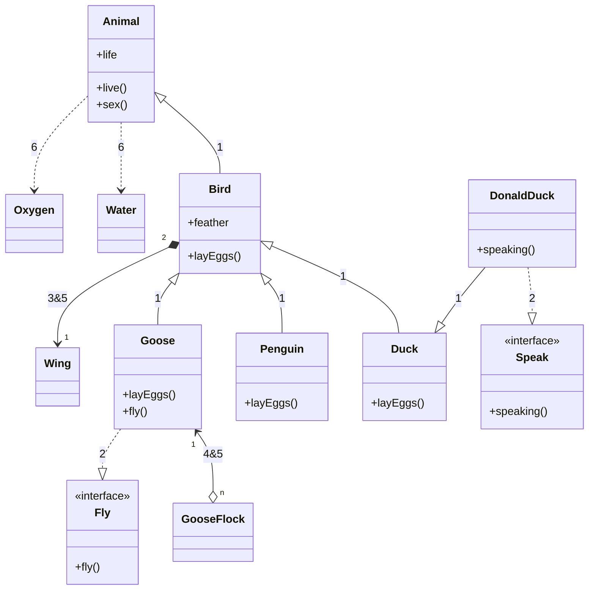
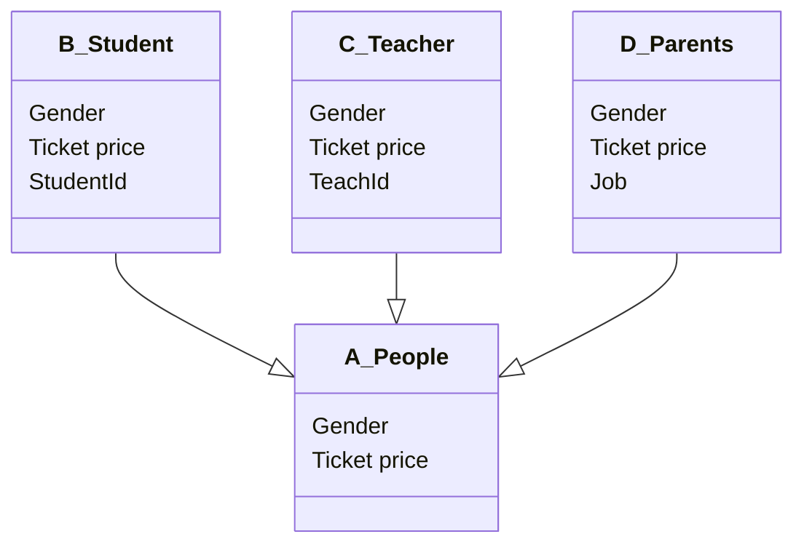

## Knowledge Classification

| 一级分类                          | 二级分类           | 主要内容                                     |
| ----------------------------- | -------------- | ---------------------------------------- |
| 语言基础                          | 基本语法           | 变量、数据类型、运算符、控制流程（if/else、switch）、循环      |
|                               | 函数             | 函数定义、参数传递、返回值、函数重载、默认参数                  |
|                               | 指针与引用          | 指针声明、指针运算、引用基础、指针与引用的区别                  |
| 面向对象编程                        | 类与对象           | 类定义、构造函数、析构函数、成员变量和方法                    |
|                               | 继承             | 单继承、多继承、虚继承、继承访问控制                       |
|                               | 多态             | 虚函数、动态绑定、抽象类、接口                          |
| 高级特性                          | 模板             | 函数模板、类模板、模板特化、变参模板                       |
|                               | 异常处理           | try-catch、异常类型、自定义异常                     |
|                               | Lambda表达式      | 匿名函数、闭包、捕获列表                             |
| 内存管理                          | 内存分配           | new/delete、动态内存分配                        |
|                               | 智能指针           | unique_ptr、shared_ptr、weak_ptr           |
| 标准库                           | 容器             | vector、list、map、set、deque                |
|                               | 算法             | 排序、查找、变换、数值算法                            |
|                               | 迭代器            | 迭代器类型、迭代器适配器                             |
| 并发编程                          | 线程             | std::thread、线程同步、互斥锁                     |
|                               | 并发原语           | condition_variable、atomic、future/promise |
| 元编程                           | 模板元编程          | 类型推导、SFINAE、编译期计算                        |
|                               | 类型萃取           | type_traits、conditional、enable_if        |
| [[#Main version|现代C++特性]] | C++11/14/17/20 | auto、decltype、constexpr、结构化绑定、概念         |
| 性能优化                          | 右值引用           | 移动语义、完美转发                                |
|                               | 编译优化           | 内联、常量折叠、返回值优化                            |
| 底层编程                          | 内存模型           | 字节对齐、内存布局                                |
|                               | 位操作            | 位运算、位域                                   |

## Main version

| C++ version | Release year | Main improvment                             |
| ----------- | ------------ | ------------------------------------------- |
| C++98       | 1998         | 标准模板库 (STL)                                 |
|             |              | 引入命名空间                                      |
|             |              | 支持异常处理                                      |
|             |              | 类型继承与多态                                     |
| C++03       | 2003         | 小幅度改进，修复一些C++98中的缺陷                         |
|             |              | 提升标准库一致性                                    |
| C++11       | 2011         | 自动类型推导 (`auto`)                             |
|             |              | 范围for循环                                     |
|             |              | 智能指针 (`std::shared_ptr`, `std::unique_ptr`) |
|             |              | Lambda 表达式                                  |
|             |              | 右值引用与移动语义                                   |
|             |              | 并发支持 (`std::thread`)                        |
|             |              | 静态断言 (`static_assert`)                      |
| C++14       | 2014         | 泛型Lambda                                    |
|             |              | 二进制字面值                                      |
|             |              | `std::make_unique`                          |
|             |              | 提升Lambda捕获能力                                |
| C++17       | 2017         | `std::optional`                             |
|             |              | `std::variant`                              |
|             |              | `std::any`                                  |
|             |              | 结构化绑定                                       |
|             |              | 并行算法支持                                      |
|             |              | 文件系统库                                       |
| C++20       | 2020         | 概念（Concepts）                                |
|             |              | 范围库（Ranges）                                 |
|             |              | 协程（Coroutines）                              |
|             |              | 模块化（Modules）                                |
|             |              | 三路比较运算符（<=>，即太空船运算符）                        |
| C++23       | 预计2023       | 新的标准库功能（如 `std::expected`, `std::flat_map`） |
|             |              | 增强的类型特性                                     |
|             |              | 更强的constexpr支持                              |
|             |              | 增强的lambda表达式和模板参数                           |

## 基础特性

### 类之间的关系

| ID  | Type           | Description | Remark                        |
| :-: | -------------- | :---------: | ----------------------------- |
|  1  | Inheritance-继承 |   `--\|>`   | `is a`; 箭头指向父类                |
|  2  | Realization-实现 |   `..\|>`   | 多个操作函数可以写成一个接口                |
|  3  | Composition-组合 |    `--*`    | `has a`;整体与部分, 部分离开整体不能存在; 同步 |
|  4  | Aggregation-聚合 |    `--o`    | 整体与部分, 互相均可独立存在; 不同步          |
|  5  | Association-关联 |    `-->`    | 可以是单向, 也可以是双向                 |
|  6  | Dependency-依赖  |    `..>`    | 使用的关系, 尽量避免双向依赖               |

- **关系的强弱程度: 1 = 2 > 3 >4 >5 >6**[^1]



### C++特性

1. 封装(一阶抽象)
    - 实现代码的模块化
1. 继承(二阶抽象)
    - 实现代码的复用
    - 父类到子类, 是抽象到一般的过程
1. 多态(三阶抽象)
    - 实现接口的复用
    - 通过*抽象*的接口, 得到*一般*的结果
    - 分类
      - 静态: 函数重载 & 模板类
      - 动态: `virtual`

- 说明:
  - A是父类, BCD是子类
  - A所包含的general接口分为两类
    - In不同, Out相同(抽象的接口, 抽象的结果), 该部分不需要重载
    - In不同, Out不同(抽象的接口, 一般的结果), 该部分需要重载

| 目的                          | 对象  | 手段     |
| --------------------------- | --- | ------ |
| 抽象参数类型 (int/double/float)   | 函数  | 模板、重载  |
|                             | 类   | 模板     |
| 抽象参数个数 (agrs 1-n)           | 函数  | 重载     |
| 抽象类的类型(father/son1/son2...) | 类   | 继承&虚函数 |
> [!note] 最终目的
> 用户端看到的**类的类型**一致（基类），调用的**函数名**一致，但是类有不同*类类型*可以选，传入的*参数类型*也可以选，函数会多一个传入的*参数个数*也可以选




### Class与Struct的区别

1. 数据类型
    - struct: 值类型, 复制, 栈, 快
    - class: 引用类型, 同一个指向, 堆, 慢
1. 默认访问权限
    - struct: public
    - class: private

## 句柄-handle

[Reference](https://blog.csdn.net/qq_39584315/article/details/81909135)
名词：柄，把柄
动词：处理

### 本质

- HANDLE中存放的是B的最新地址
- A 通过 HANDLE 寻找B
- A与B无法直接对接，避免误操作

windows是以虚拟内存为基础的操作系统
句柄地址(稳定)→记载着对象在内存中的地址→对象在内存中的地址(不稳定)→实际对象

- 指针可以当句柄，句柄不一定都是指针
- 句柄只是代表某一个对象的一个数字
  - 根据这个数字可以通过某种关系找到这个对象
  - 指针是一个对象的地址

### 例1

```cpp
DECLARE_HANDLE(HDC);
[[define]] DECLARE_HANDLE(name) struct name##__ { int unused; };
typedef struct name##__ *name

# 将name替换为HDC
struct HDC__{int unused;};
typedef struct HDC__ *HDC
```

> 句柄：一个指向某一结构的指针，这个结构体只有一个成员，它是一个整数

### 例2

```cpp
typedef PVOID HANDEL;
typedef void *PVOID;
```

> HANDLE不过是一个指向void型，即无类型的指针，充当索引的作用

## 引用和指针

定义对象时, 分配存储空间(房间)
    - 该空间有其地址(位置)和名称(对象名)两个属性, 地址是唯一的, 但是名称可以不唯一(某个命名空间内是唯一即可),遂可通过引用来取别名
    - 该空间的内容可通过2种方式获取, 一: 通过对象名直接获取, 二: 通过地址获取时候需要使用符号`(*)`来获取

- sample

    ```cpp
    // 2 stages
    // stage 1: 定义
    int val = 10;
    /// 引用
    int &ref = val;
    /// 指针
    //// 定义及赋值
    int *pointer_a = &val;
    //// 先定义, 再赋值
    int *pointer_b;
    pointer_b = &val;
    // stage 2: 使用
    /// 引用名当做对象名无差别使用
    /// 地址需要取用才能获取内容 *
    ```

### 引用

- 是什么: 引用是对象的别名
- 使用注意事项:
  - 引用必须初始化
  - 允许定义多个引用
  - 对引用的操作就是对其绑定对象的操作

### 指针

- 是什么: 存放某个对象地址(位置)的符合类型
- 与引用的区别: 指针本身就是对象, 允许赋值和拷贝, 无需定义及赋初值
- 使用注意:
  - void *指针：一种特殊类型的指针，可用于存放任意对象的地址。void类型指针不能访问其指向对象。
    - void指针需要强制转换成其它类型才能使用

### 什么时候用引用，什么时候用指针
| 特性        | 指针                  | 引用                  |
| --------- | ------------------- | ------------------- |
| **可否为空**  | 可以为 `nullptr`，灵活性更强 | 不能为 `nullptr`，安全性更高 |
| **指向改变**  | 可以在程序中指向不同对象        | 一旦绑定，不可更改           |
| **语法复杂性** | 语法较复杂，需要解引用和检查空指针   | 语法较简单，使用便捷          |
| **内存操作**  | 适用于需要手动管理内存的场景      | 不适合内存管理操作           |
| **性能**    | 直接操作内存，效率较高         | 一般用于简单的对象传递，效率较高    |
| **用途**    | 动态内存分配、数组操作、复杂对象传递  | 简单对象传递、不改变对象指向的场景   |
| **风险**    | 易出错，需要额外的检查和管理      | 相对安全，减少空指针错误        |

> 总的来说，指针和引用都能够实现在不复制值的情况下访问内存数据，引用在操作上会更快捷
> - 实际应用中能用引用就用引用
> - 在处理数组/链表/树等数据结构时候就必须的用指针
#### 智能指针

- 英文: Smart Pointers
- 是什么?
  - 是包含有原生指针的类模板, 可以用来管理指针的生命周期
  > A smart pointer is a class that wraps a 'raw' (or 'bare') C++ pointer, to manage the lifetime of the object being pointed to. There is no single smart pointer type, but all of them try to abstract a raw pointer in a practical way.
- 为什么?
  - 管理生命周期, 可以不要额外删除释放指针
- 设计理念[^1]
  - RALL(Resource Acquisition Is Initialization): 一种利用对象生命周期来控制程序资源（如内存、文件句柄、网络连接、互斥量等等）的简单技术
- 类型
  - `std::unique_ptr`
    - 将拷贝构造函数和赋值重载函数禁用
  - `std::shared_ptr`
    - 允许多个指针指向同一块地址, 且只会被释放一次
    - 原理:采用引用计数原理来实现共享资源
      1. 内部维护一份引用计数, 记录该资源被几个对象共享
      1. 当一个shared_ptr对象被销毁时, count-1
      1. count=0时, 就释放资源
      1. count!=0时, 不能释放资源, 其他对象不会成为野指针'
    - 问题: 循环引用异常, 可用`std::weak_ptr`来解决
  - `std::weak_ptr`
    - weak_ptr对象指向shared_ptr对象时，不会增加shared_ptr中的引用计数
  - `std::auto_ptr` (已弃用)
    - 原理: 原对象拷贝给新对象的时候, 原对象就被设置为 nullptr

| 智能指针类型            | 解决的问题         | 目前存在的问题                 |
| ----------------- | ------------- | ----------------------- |
| `std::unique_ptr` | - 独占所有权       | - 不可复制                  |
|                   | - RAII 原则     | - 不适合共享                 |
| `std::shared_ptr` | - 共享所有权       | - 性能开销较高                |
|                   | - 自动释放        | - 线程安全性问题               |
|                   |               | - 循环引用可能导致内存泄漏          |
| `std::weak_ptr`   | - 打破循环引用      | - 必须与 `shared_ptr` 配合使用 |
|                   | - 有效的资源管理     | - 需要额外的检查               |
| `std::auto_ptr`   | - 简单的 RAII 机制 | - 无法转移所有权               |
|                   |               | - 不再推荐使用                |

### 含有指针的结构体


## 编译问题

### Undefined symbol

1. 头文件中定义了函数, 但是cpp文件中函数的构建时候, 没有加上namespace, 会导致函数无法被识别
1. c与cpp混合使用时, 需要在头文件中添加如下code

    ```cpp
    [[ifdef]] __cplusplus
    extern “C” {
    [[endif]]

    void xxxxx(xxx)

    [[ifdef]] __cplusplus
    }
    [[endif]]
    ```

### LOG_TAG

```cpp
#ifdef LOG_TAG
#undef LOG_TAG
#endif
#define LOG_TAG "Horizon"
```

需要添加在所有的`#include`之后, 只有才能保证log_tag有效

---
## 头文件

1. `#inclued` 使用`<>`
	- 编译器从系统的标准库中查找要包含的头文件, 不会在当前源文件的目录中查找
	- 常用于包含标准的头文件
1. `#include`使用`""`
	- 引入用户自定义的头文件

## 数据类型

中文单位 | 中文简称 | 英文单位 | 英文简称 | 进率(Byte=1)
--------|---------|----------|----------|-----------------
位       | 比特     | bit      | b        | 0.125
字节     | 字节     | Byte     | B        | 1
字       | 字       | Word     | Word     | 2
千字节   | 千字节   | KiloByte | KB       | $2^{10}$ OR 1024
兆字节   | 兆字节   | MByte    | MB       | $2^{20}$

```cpp
/* exact-width signed integer types */
typedef   signed          char int8_t;   // 1 byte
typedef   signed short     int int16_t;  // 2 bytes
typedef   signed           int int32_t;  // 4 bytes
typedef   signed       __INT64 int64_t;  // 8 bytes

/* exact-width unsigned integer types */
typedef unsigned          char uint8_t;
typedef unsigned short     int uint16_t;
typedef unsigned           int uint32_t;
typedef unsigned       __INT64 uint64_t;
```
### Type

| Type   | Byte | Bit   | Minimum              | Maximum                            |
| ------ | ---- | ----- | -------------------- | ---------------------------------- |
| bool   | 1    | 8bit  |                      |                                    |
| byte   | 1    | 8bit  | $-2^{7}$             | $2^7-1$                            |
| char   | 1    | 8bit  | 0                    | $2^{8}-1$  = 255                   |
| short  | 2    | 16bit | $-2^{15}$            | $2^{15}-1$                         |
| int    | 4    | 32bit | $-2^{31}$            | $2^{31}-1$                         |
| long   | 8    | 64bit | $-2^{63}$            | $2^{63}-1$                         |
| float  | 4    | 32bit | $1.4\times10^{-45}$  | $3.4028235\times10^{38}$           |
| double | 8    | 64bit | $4.9\times10^{-324}$ | $1.7976931348623157\times10^{308}$ |

### Modifiers

| Modifiers                 | Desc                      |
| ------------------------- | ------------------------- |
| signed                    | decide value range offset |
| unsigned                  | short: /2                 |
| decide value range length | long: x2                  |

### Float
1. 存储方式如下：
	1. **符号位**（Sign bit）：1位，表示正负
	2. **指数位**（Exponent）：8位，用来表示数的范围
	3. **尾数位**（Mantissa/Significand）：23位，表示精度
2. 计算方式：$\text{value}=(-1)^\text{sign}\times(1.mantissa)\times2^{(exponent-127)}$

---
## 数据存放

栈和堆都在RAM(Random Access Memory)上[^2]

### 栈

- 特点: 先进先出, 内存在申请之后就不会变化, 无碎片化, 读取速度快, 内存由系统自动释放
- 分配者: 操作系统
- 存放的数据: 基础数据类型(int, double,short, char等)

### 堆

- 特点: 分配自由, 内存地址不连续, 有碎片, 读取慢, 适合存放大小不固定的数据结构
- 分配者: 程序员
- 存放的数据: 数组, 结构体, 全局变量(避免被系统回收)

---
## 死锁问题

XXX 待进一步学习死锁问题

1. 是什么?
	- 多线程和多进程改善了系统资源的利用率并提高了系统的处理能力, 但他们的并发操作, 互相等待的过程, 带来了死锁的问题
2. 解决方法
	- 破坏互斥条件: 被调用数据拷贝成两份
	- 破坏等待条件:

---
## Lambda表达式

### 目的
1. **简化函数对象的编写**：Lambda 允许开发者在需要一个小型、临时的函数对象时，不必编写一个完整的函数定义或函数对象类。
2. **提高代码的可读性和简洁性**：Lambda 表达式可以减少模板函数或算法中对函数对象的冗长定义。
3. **捕获周围作用域的变量**：Lambda 可以捕获并使用其周围作用域中的变量，这使得它非常适合用于闭包或需要访问外部变量的场合。
4. **支持泛型编程**：Lambda 表达式可以与标准库中的算法和容器一起使用，提供一种灵活的方法来自定义操作。
5. **便于实现回调机制**：在事件驱动或异步编程中，Lambda 表达式可以作为回调函数，方便地处理事件或响应。

### 样例
`[capture-list] (parameters) -> returntype {statement}
`
```cpp
auto add = [](int a, int b) -> int {return a+b};
```

### 使用注意事项
1. **捕获方式**：
    - `[]`：不捕获任何外部变量。
    - `[&]`：通过引用捕获所有外部变量。
    - `[=]`：通过值捕获所有外部变量。
    - `[a, &b]`：通过值捕获变量 `a`，通过引用捕获变量 `b`。
2. **变量作用域**：Lambda 表达式不能捕获非静态局部变量或由 `register` 关键字声明的变量。
3. **类型推断**：Lambda 表达式的返回类型可以由编译器自动推断，但有时可能需要显式指定返回类型，尤其是在 Lambda 表达式体中包含多条语句时。
4. **性能考虑**：虽然 Lambda 表达式提供了便利，但过度使用或不当使用（如捕获大量变量）可能会影响程序性能。
5. **可读性**：Lambda 表达式应该保持简洁，如果 Lambda 表达式过于复杂，可能需要考虑将其转换为普通函数。
6. **线程安全**：如果 Lambda 表达式用于多线程环境，需要确保捕获的变量是线程安全的。
7. **异常安全性**：Lambda 表达式在捕获变量时，如果这些变量的类型不保证异常安全性，那么 Lambda 本身也可能不具备异常安全性。
8. **内存分配**：对于通过值捕获的大型对象，Lambda 表达式可能会增加内存使用，因为每个 Lambda 表达式实例都会复制这些对象。

## Containers

| 容器/容器适配器              | 主要特性和描述                             | 内存连续性   | 核心功能的时间复杂度                | 核心功能的空间复杂度       | 主要应用场景                  |
| --------------------- | ----------------------------------- | ------- | ------------------------- | ---------------- | ----------------------- |
| `std::vector`         | 动态数组，支持随机访问和尾部插入/删除，中间插入/删除效率低      | 连续      | 访问/插入/删除：O(1)             | 元素数量 + 额外空间 O(n) | 需要高效的随机访问和尾部插入/删除的数据结构  |
| `std::deque`          | 双端队列，支持在头部和尾部进行高效的插入和删除操作，支持随机访问    | 每个块内部连续 | 访问/插入/删除：O(1)             | 元素数量 + 额外空间 O(n) | 需要高效的双端操作和随机访问的数据结构     |
| `std::list`           | 双向链表，元素可以在**任意**位置插入和删除，不支持随机访问     | 不连续     | 插入/删除：$O(1)$<br>查找：$O(n)$ | 每个节点 + 额外空间 O(n) | 频繁的插入和删除操作，不需要随机访问的数据结构 |
| `std::forward_list`   | 单向链表，元素只能在**头部**插入和删除，不支持反向迭代器和随机访问 | 不连续     | 插入/删除：O(1)<br>查找：O(n)     | 每个节点 + 额外空间 O(n) | 需要频繁在头部进行插入和删除操作的场景     |
| `std::set`            | 基于红黑树的有序集合，元素自动排序，不能有重复元素           | 不连续     | 插入/删除/查找：$O(log n)$       | 元素数量 + 额外空间 O(n) | 需要有序存储和高效的插入/删除/查找操作的场景 |
| `std::map`            | 基于红黑树的有序映射，键值对按照键自动排序，不能有重复键        | 不连续     | 插入/删除/查找：$O(log n)$       | 元素数量 + 额外空间 O(n) | 需要有序映射和高效的插入/删除/查找操作的场景 |
| `std::unordered_set`  | 哈希表实现的无序集合，元素无序存储，不能有重复元素           | 不连续     | 插入/删除/查找：平均 O(1)          | 元素数量 + 额外空间 O(n) | 需要高效的无序插入/删除/查找操作的场景    |
| `std::unordered_map`  | 哈希表实现的无序映射，键值对无序存储，不能有重复键           | 不连续     | 插入/删除/查找：平均 O(1)          | 元素数量 + 额外空间 O(n) | 需要高效的无序映射和插入/删除/查找操作的场景 |
| `std::stack`          | 栈容器适配器，后进先出（LIFO）顺序，仅支持顶部操作         | -       | 插入/删除/访问：O(1)             | 元素数量 + 额外空间 O(n) | 需要后进先出操作顺序的场景           |
| `std::queue`          | 队列容器适配器，先进先出（FIFO）顺序，支持队尾插入和队头删除操作  | -       | 插入/删除/访问：O(1)             | 元素数量 + 额外空间 O(n) | 需要先进先出操作顺序的场景           |
| `std::priority_queue` | 优先队列容器适配器，基于堆实现的优先级队列，支持按优先级获取和插入元素 | -       | 插入/删除/访问：$O(log n)$       | 元素数量 + 额外空间 O(n) | 需要按优先级获取和插入元素的场景        |

### Deque

![[cpp 2024.excalidraw.svg|deque principle|300]]

- A deque is somewhat recursively defined: internally it maintains a double-ended queue of _chunks_ of fixed size. Each chunk is a vector, and the queue (“map” in the graphic below) of chunks itself is also a vector[^4].
- 2-d vector: a vector of vectors

## 迭代器

1. 目的
	1. 统一访问接口: 数组, 链表, 集合都可以使用一致的方式
	2. 独立于容器实现: 不需要知道容器内部细节即可读取内部value
	3. 支持泛型编程: 在不同类型的容器上执行相同的算法, 提高通用性和移植性

---
## 多线程

| 头文件                      | 作用                | 主要类                                                                                                     |
| ------------------------ | ----------------- | ------------------------------------------------------------------------------------------------------- |
| `<thread>`               | 创建&管理线程           | `std::thread`                                                                                           |
| `<mutex>`                | 线程间的互斥操作          | 锁：`std::mutex`、`std::recursive_mutex`、`std::timed_mutex`<br>锁管理：`unique_lock` 、 `lock_guard` - 避免死锁[^6] |
| `<condition_variable>`   | 用于线程间的条件等待和通知     | `std::condition_variable` <br>`std::condition_variable_any`                                             |
| `<future>`               | 实现异步操作和同步操作       | `std::promise`：允许在某个线程设值<br>`std::future`：允许在另一个线程获取值<br>`std::async`：启动异步任务，并发挥future对象                |
| `<atomic>`               | 用于原子操作，确保操作的不可分割性 | `std::atomic`                                                                                           |
| `<shared_mutex>` - c++17 | 用于共享锁的机制          | `std::shared_mutex` 、`std::shared_lock`                                                                 |

---
## 参考资料

- [C++ Data Types](https://www.tutorialspoint.com/cplusplus/cpp_data_types.htm)
- [c++多线程：这可能是讲死锁最通俗的一篇文章](https://zhuanlan.zhihu.com/p/643130609)

[^1]:[智能指针详细解析(智能指针的使用,原理分析)](https://zhuanlan.zhihu.com/p/642134340)
[^2]:[What’s the difference between a stack and a heap?](https://www.programmerinterview.com/data-structures/difference-between-stack-and-heap/)
[^3]:[类与类之间的关系](https://blog.csdn.net/fry3309/article/details/123359536)
[^4]:[deque 原理](https://stackoverflow.com/questions/6292332/what-really-is-a-deque-in-stl)
[^5]:[Pointers vs References in C++](https://www.geeksforgeeks.org/pointers-vs-references-cpp/)
[^6]:[C++ lock_guard和unique_lock的区别 | 闫金钢的Blog](https://blog.yanjingang.com/?p=6547)
[^7]:[动态内存管理示例 · 恋恋风辰的编程笔记](https://gitbookcpp.llfc.club/sections/cpp/section6/cpp29.html)