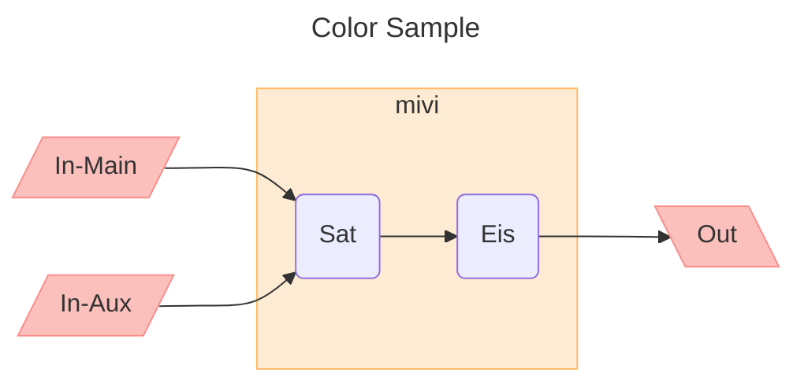

### Related Webs

| Type          | Web                                                                                                                                                                                                                                                                                         |
| ------------- | ------------------------------------------------------------------------------------------------------------------------------------------------------------------------------------------------------------------------------------------------------------------------------------------- |
| Color         | [Converting Colors](https://convertingcolors.com/)                                                                                                                                                                                                                                          |
| Icon          | [GrapheMica](https://graphemica.com/) [Material Icons](https://fonts.google.com/icons) [Vector Icons and Stickers](https://www.flaticon.com/) [codicon](https://microsoft.github.io/vscode-codicons/dist/codicon.html) [octicon](https://primer.style/design/foundations/icons) |
| Blog          | [Vonge](https://jazzed-kale.cloudvent.net/projects/)                                                                                                                                                                                                                                        |
| Design System | Microsoft - [Fluent 2 Design System](https://fluent2.microsoft.design/) Google - [Material Design](https://m3.material.io/)                                                                                                                                                              |

### Wonderful color

| Range  | Color         | Light  | Middle | Heavy  | Desc          |
| ------ | ------------- | ------ | ------ | ------ | ------------- |
| Feishu | Green         | d9f5d6 | b7edb1 | 8ee085 |               |
|        | Purple        | ece2fe | cdb2fa | ad82f7 |               |
|        | Blue          | e1eaff | bacefd | 82a7fc |               |
|        | Yellow        | ffffcc | fffca3 | fff67a |               |
|        | Orange        | feead2 | fed4a4 | ffba6b |               |
|        | Red           | fde2e2 | fbbfbc | f98e8b |               |
|        | Grey          | ebecee | dddfe1 | dee0e3 |               |
| Others | pink          | b76287 |        |        |               |
|        | deep blue     | 073642 |        |        |               |
|        | dark blue     | 282c34 |        |        | one half dark |
|        | orange yellow | fedeb9 |        |        |               |
|        | light blue    | f4f4f5 |        |        |               |

### Mermaid

| Range    | Shape             | Color                                  |
| -------- | ----------------- | -------------------------------------- |
| I/O      | Parallelogram     | red - `fill:#fbbfbc,stroke:#f98e8b`    |
| SubGraph | Rounded rectangle | orange - `fill:#feebd3,stroke:#ffba6b` |

