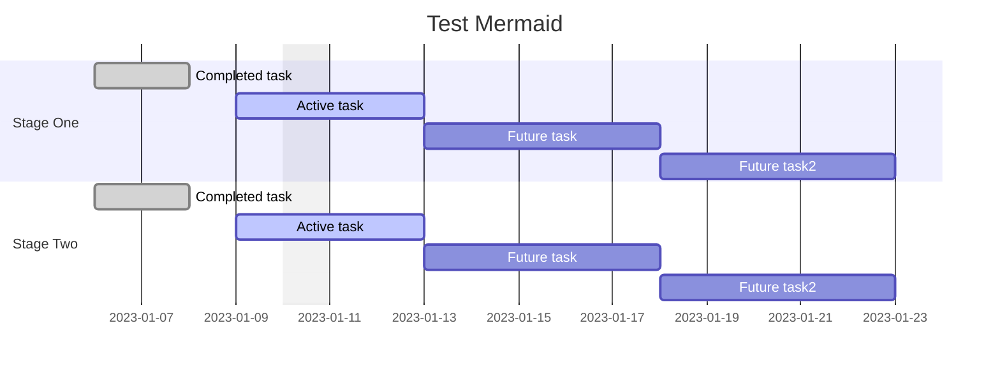
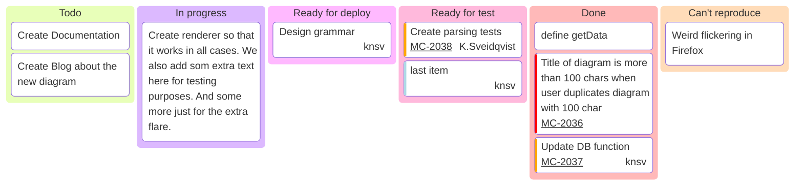
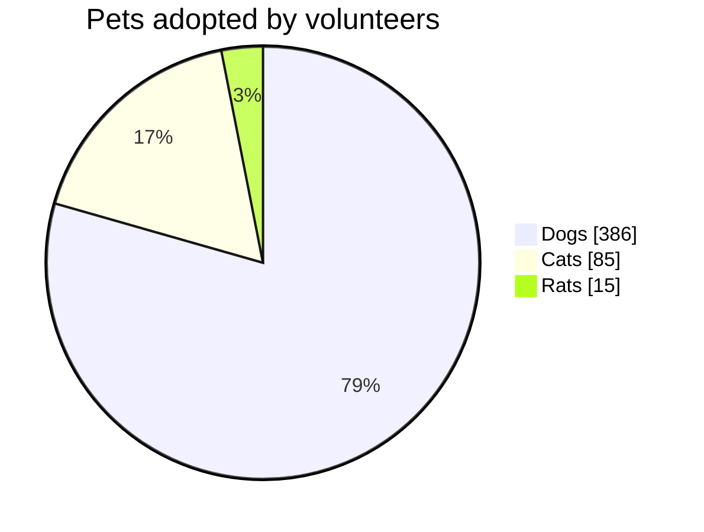
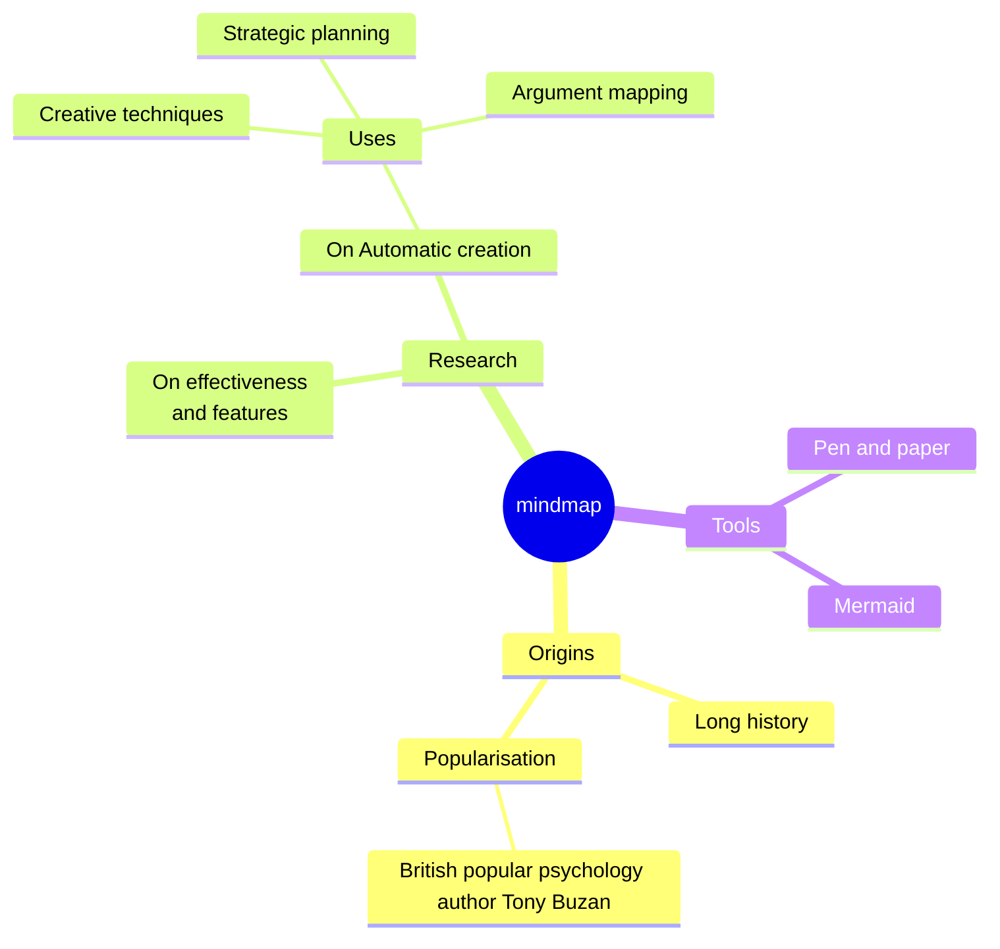
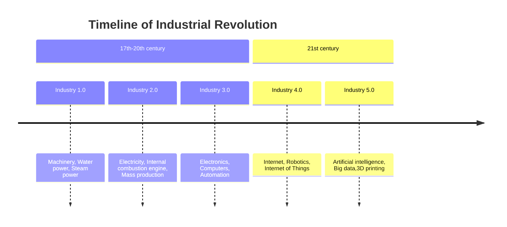
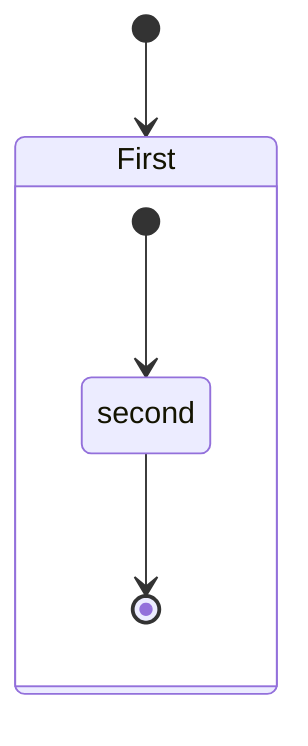
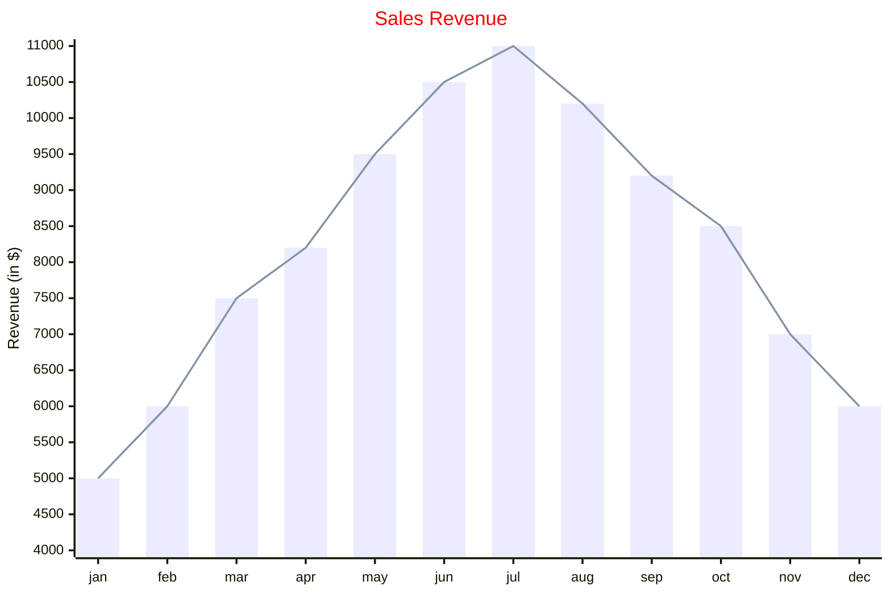
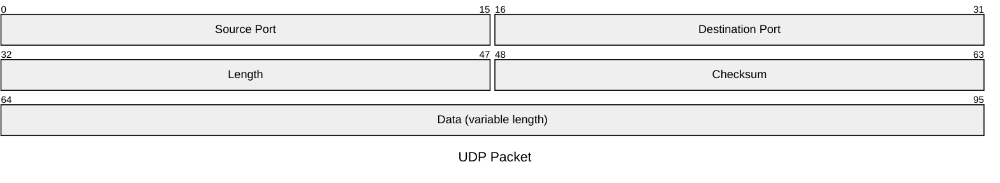

## Mermaid

[Mermaid 使用教程：从入门到精通](https://zhuanlan.zhihu.com/p/627356428)

### Gantt

官方说明: <http://mermaid.js.org/syntax/gantt.html>

### Kanban

### Pic Chart

### Mindmaps

### Timeline

### State Diagram

### XYChart

### Packet

## [Bitfield](https://github.com/wavedrom/bitfield)
## Ditaa[^1]

## Markmap

[官方Doc](https://markmap.js.org/docs/json-options)

[^1]:[字符画——ditaa使用指南，文本格式下作图](https://zhuanlan.zhihu.com/p/429506479?utm_id=0)
