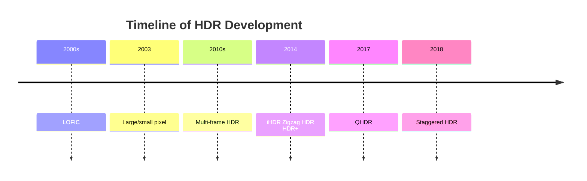

## High Dynamic Range

### Timeline

### Principle

1. Human-eye's dynamic range is **100dB** 
2. Sensor
	1. $DR = 20log_{10}(\frac{i_{max}}{i_{min}})$
		1. $i_{min}$ is **blacklevel**
		2. if ADC bit depth is $n$，$DR = 6.02 \times n + 1.76$
	2. Range:
		1. High: > 80dB
		2. Normal: < 80dB
		3. 8bit - (1, 255)
		4. 10bit - (1, 1023)  DR = 60
		5. 12bit - (1, 4095)  DR = 72

### Classification

| Frame Number | Name                                     | Desc |
| ------------ | ---------------------------------------- | ---- |
| Single[^1]   | Quad Bayer HDR                           |      |
|              | Interlaced HDR                           |      |
|              | Zig-zag HDR                              |      |
|              | DCG                                      |      |
| Multi        | Multi-frame - *LBMF*                  |      |
|              | Line Interleaving HDR - *DOL/Stagger* |      |

### HDR Format Comparison

| Feature                      | LBMF (Less blanking multi frame) | F DOL       | DCG         | M stream                                          |
| ---------------------------- | -------------------------------- | ----------- | ----------- | ------------------------------------------------- |
| **Cost**                     | High cost                        | Middle cost | Middle cost | No extra cost                                     |
| **Dynamic range**            | Excellent                        | Excellent   | Low         | Good                                              |
| **Noise level at dark area** | Excellent                        | Excellent   | Excellent   | Good (Exposure time for long exposure is limited) |
| **Motion artifact**          | Good                             | Good        | Excellent   | Worse                                             |
| **Power consumption**        | Good                             | Good        | Good        | Good                                              |

![[hdr 2025.excalidraw.svg|500]]
%%[[hdr 2025.excalidraw.md|🖋 Edit in Excalidraw]]%%

[^1]: [图像传感器HDR技术 - 知乎](https://zhuanlan.zhihu.com/p/657455970)