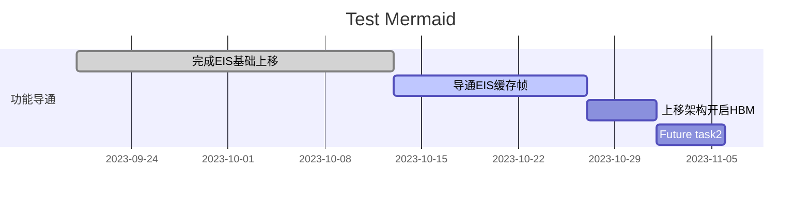
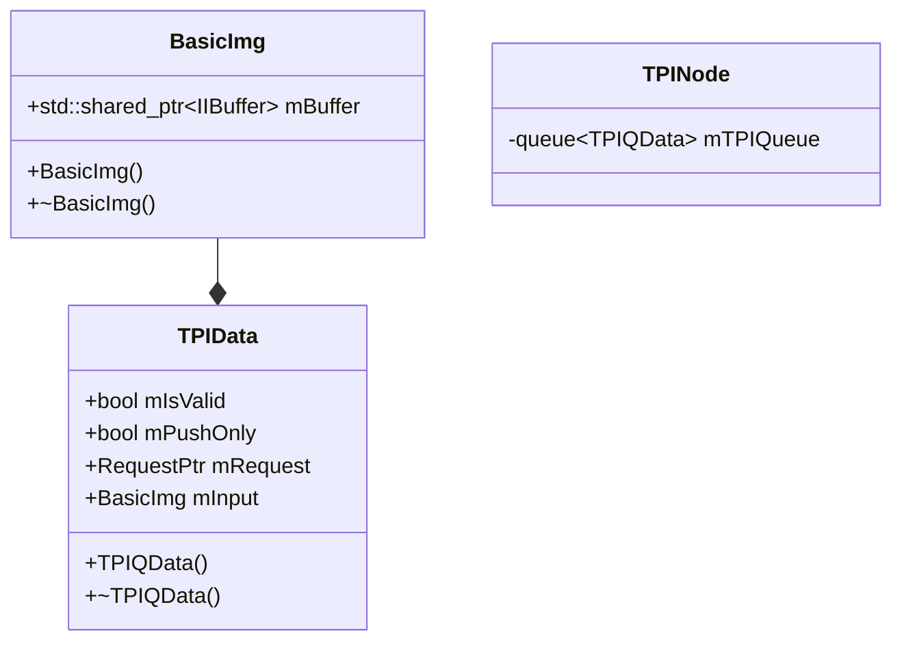

- XM MTK平台相机预研规划项]
- MTK-EIS 60帧缓存

## Flow

![[60q 2025.excalidraw#^frame=flow|700]]

![[60q 2025.excalidraw#^frame=flow_diagram|600]]

![[60q 2025.excalidraw#^frame=new_flow|600]]

## HBM #hbm

- android tag: `MTK_INFO_SUPPORTED_BUFFER_MANAGEMENT_VERSION`
- hal core tag:
  - `MTK_HALCORE_SUPPORT_HAL_BUFFER_MANAGEMENT`

strategy: Preparatory/Immediate/Cached

![[60q 2025.excalidraw#^frame=hbm_flow|500]]

Preparatory: request一下去就申请buffer Immediate: 检测到没有带appOutBuffer, 就会立即去拿buffer

填写app-buffer的位置是哪儿? MTK-HAL

producer & confumer 总的限制为64块

FHD下面增量为2-3 mips
