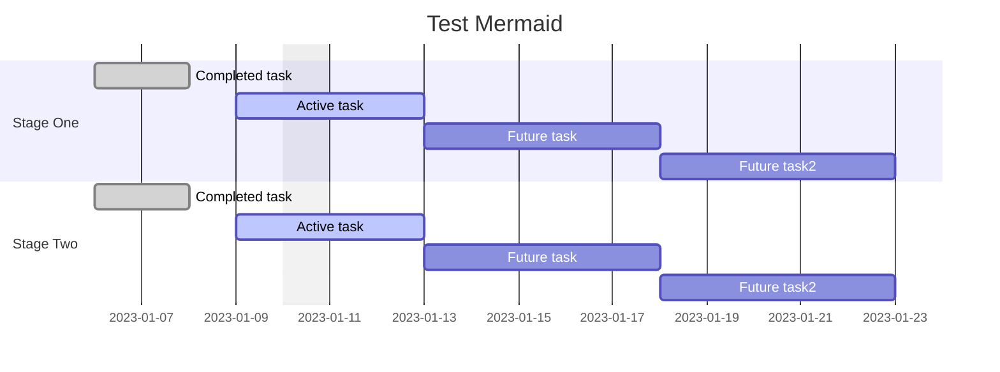
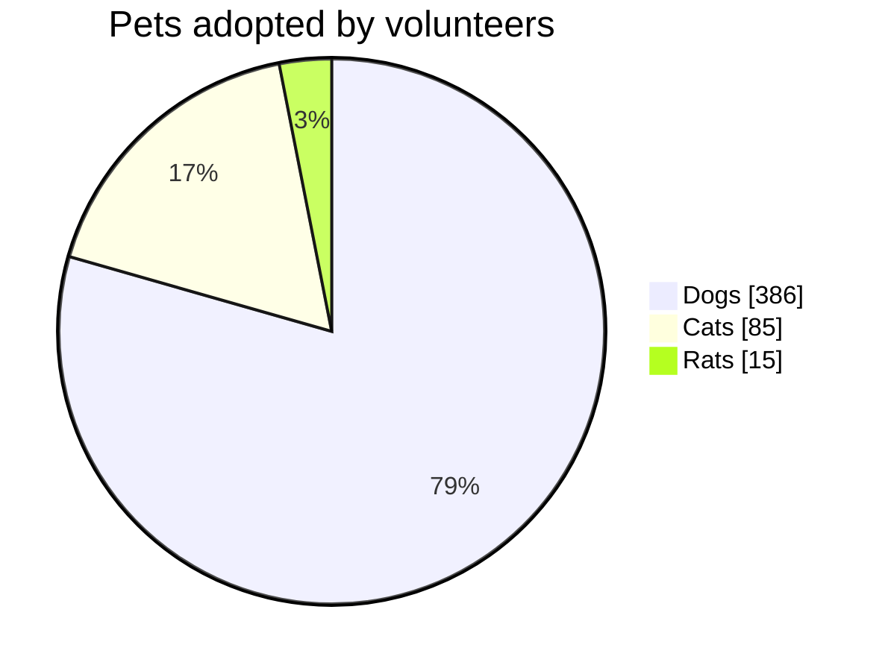
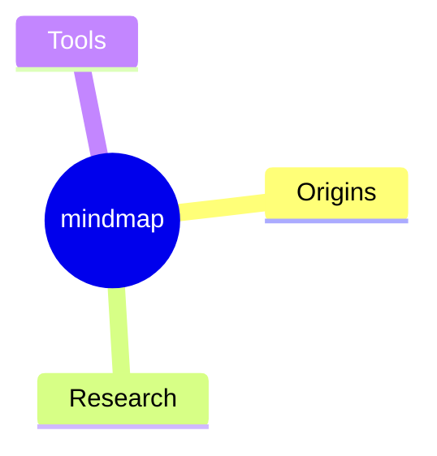
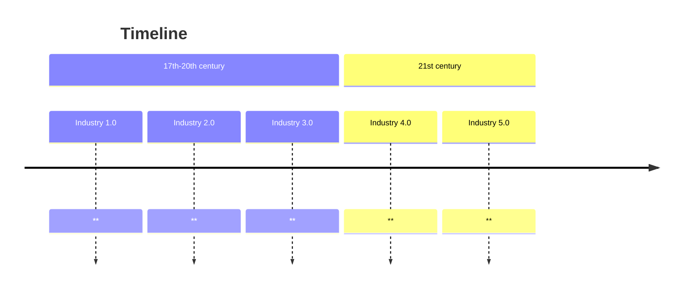
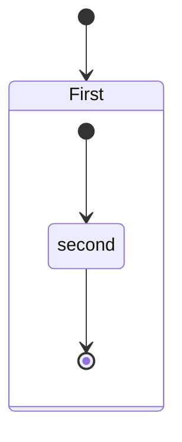
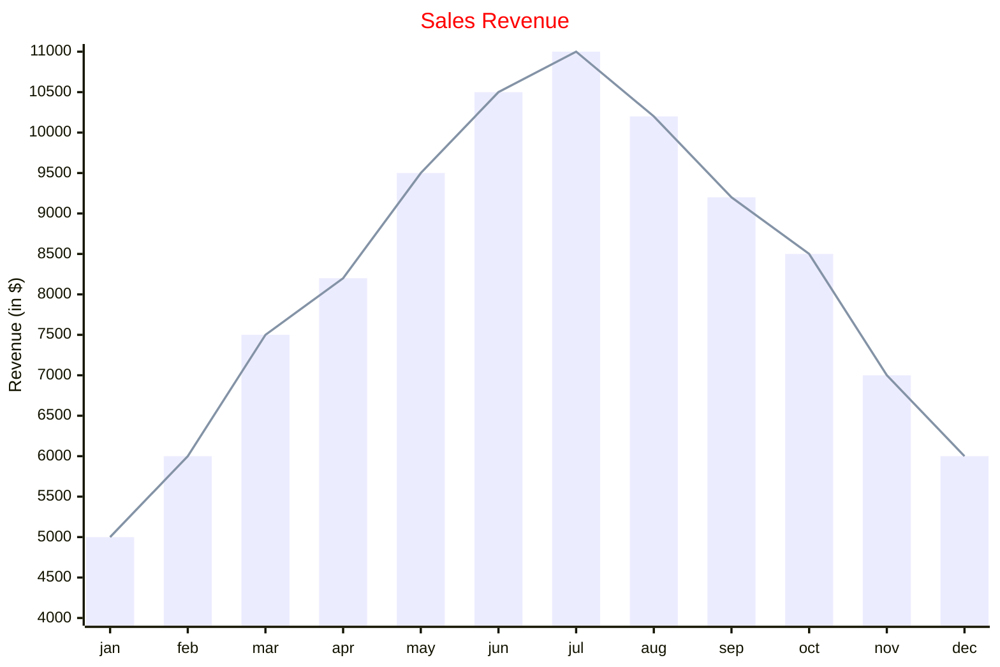
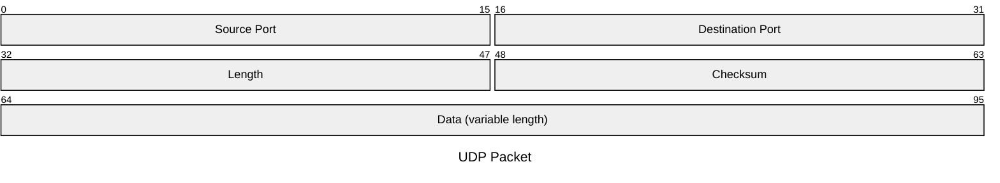

## Mermaid

> [!Attention]
>
> - [ ] under class, can not using two `<`, such as `map<int, shared_ptr<Wrap>>`

### Class

1. Section
   1. All class & namespace list
   2. Special class declarations
   3. Links
   4. Appearance customization( ==obsidian can't support==)

### Gantt

Intro[^4]

### Pic Chart

### Mindmaps

### Timeline

### State Diagram

### XYChart

### Packet

## Bitfield

intro[^3]

## Ditaa

intro[^1]

## Markmap

intro[^2]

[^1]: [字符画——ditaa使用指南，文本格式下作图](https://zhuanlan.zhihu.com/p/429506479?utm_id=0)

[^2]: [JSON Options - markmap docs](https://markmap.js.org/docs/json-options)

[^3]: [wavedrom/bitfield: :cake: bit field diagram renderer](https://github.com/wavedrom/bitfield)

[^4]: [Gantt diagrams | Mermaid](http://mermaid.js.org/syntax/gantt.html)
