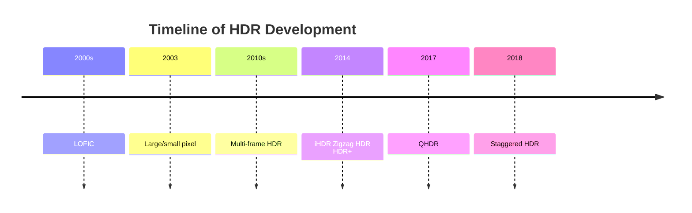

## High Dynamic Range

### Timeline

### Principle

1. Human-eye's dynamic range is **100dB**
2. Sensor
   1. $DR = 20log_{10}(\frac{i_{max}}{i_{min}})$
      1. $i_{min}$ is **blacklevel**
      2. if ADC bit depth is $n$，$DR = 6.02 \times n + 1.76$
   2. Range:
      1. High: > 80dB
      2. Normal: < 80dB
      3. 8bit - (1, 255)
      4. 10bit - (1, 1023) DR = 60
      5. 12bit - (1, 4095) DR = 72

### Classification

| A               | B              | Name                       | Desc      |
| --------------- | -------------- | -------------------------- | --------- |
| SW(High DR)[^2] | -              | Bracketing                 | L-EXP     |
|                 |                | HDR+                       | S-EXP     |
|                 |                | HDR+ with Bracketing       | L & S EXP |
| HW(Wide DR)     | Spatial-based  | Super CCD                  |           |
|                 |                | BME & SME                  |           |
|                 |                | Quad-Bayer HDR             |           |
|                 |                | Split-diode                |           |
|                 | Time-based     | Dual Sampling              |           |
|                 |                | DOL/Staggered              |           |
|                 | Response-based | Logarithmic response       |           |
|                 |                | Lin-Log & Multi-Log        |           |
|                 |                | LOFIC                      |           |
|                 |                | DCG (Dual Conversion Gain) |           |
|                 |                | DAG (Dual Analog Gain)     |           |
|                 |                | Skimming HDR               |           |

| Frame Number | Name                                     | Type | Desc |
| ------------ | ---------------------------------------- | ---- | ---- |
| Single[^1]   | Quad Bayer HDR                           | HW   |      |
|              | Interlaced HDR                           |      |      |
|              | Zig-zag HDR                              |      |      |
|              | DCG                                      |      |      |
| Multi        | Multi-frame - _LBMF_                  | SW   |      |
|              | Line Interleaving HDR - _DOL/Stagger_ |      |      |

### HDR Format Comparison

| Feature                      | LBMF (Less blanking multi frame) | F DOL       | DCG         | M stream                                          |
| ---------------------------- | -------------------------------- | ----------- | ----------- | ------------------------------------------------- |
| **Cost**                     | High cost                        | Middle cost | Middle cost | No extra cost                                     |
| **Dynamic range**            | Excellent                        | Excellent   | Low         | Good                                              |
| **Noise level at dark area** | Excellent                        | Excellent   | Excellent   | Good (Exposure time for long exposure is limited) |
| **Motion artifact**          | Good                             | Good        | Excellent   | Worse                                             |
| **Power consumption**        | Good                             | Good        | Good        | Good                                              |

![[hdr 2025.excalidraw|Multi types HDR introduction|800]]

[^1]: [图像传感器HDR技术 - 知乎](https://zhuanlan.zhihu.com/p/657455970)

[^2]: [CMOS图像传感器专题 - 1 高动态范围（HDR）成像 - Analog/RF IC 设计讨论 - EETOP 创芯网论坛 (原名：电子顶级开发网) -](https://bbs.eetop.cn/forum.php?mod=viewthread&tid=966637)
