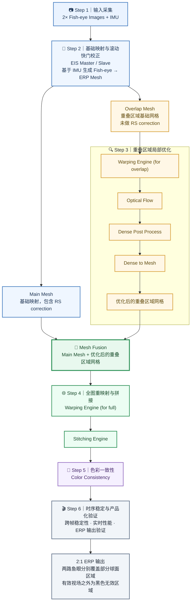

```mermaid
flowchart TD
    %% Step 1: Input
    A["📷 Step 1｜输入采集<br/>2× Fish-eye Images + IMU"]

    %% Step 2: Base mesh generation
    B["🧭 Step 2｜基础映射与滚动快门校正<br/>EIS Master / Slave<br/>基于 IMU 生成 Fish-eye → ERP Mesh"]

    A --> B

    B --> C["Main Mesh<br/>基础映射，包含 RS correction"]
    B --> D["Overlap Mesh<br/>重叠区域基础网格<br/>未做 RS correction"]

    %% Main mesh bypasses overlap optimization
    C --> M

    %% Step 3: Overlap optimization branch
    subgraph S3["🔍 Step 3｜重叠区域局部优化"]
        direction TB
        E["Warping Engine (for overlap)"]
        F["Optical Flow"]
        G["Dense Post Process"]
        H["Dense to Mesh"]
        J["优化后的重叠区域网格"]

        E --> F --> G --> H --> J
    end

    D --> E

    %% Single mesh fusion node
    M["🔀 Mesh Fusion<br/>Main Mesh + 优化后的重叠区域网格"]

    J --> M

    %% Step 4: Full remapping and stitching
    K["🌐 Step 4｜全图重映射与拼接<br/>Warping Engine (for full)"]
    L["Stitching Engine"]

    M --> K --> L

    %% Step 5: Color consistency
    N["🎨 Step 5｜色彩一致性<br/>Color Consistency"]
    L --> N

    %% Step 6: Product validation
    O["🎬 Step 6｜时序稳定与产品化验证<br/>跨帧稳定性 · 实时性能 · ERP 输出验证"]
    N --> O

    %% Output explanation
    P["2:1 ERP 输出<br/>两路鱼眼分别覆盖部分球面区域<br/>有效视场之外为黑色无效区域"]
    O --> P

    %% Styles
    classDef input fill:#EAF3FF,stroke:#4A80C2,color:#1D3557,stroke-width:2px
    classDef base fill:#EFF6FF,stroke:#4A80C2,color:#1D3557,stroke-width:2px
    classDef overlap fill:#FFF7E6,stroke:#D9A441,color:#634A0A,stroke-width:2px
    classDef fusion fill:#E8F8EE,stroke:#31945A,color:#174D2A,stroke-width:3px
    classDef stitch fill:#ECFDF3,stroke:#31945A,color:#174D2A,stroke-width:2px
    classDef color fill:#F5F0FF,stroke:#9670C2,color:#45266D,stroke-width:2px
    classDef output fill:#F1F5F9,stroke:#64748B,color:#1F2937,stroke-width:2px

    class A input
    class B,C base
    class D,E,F,G,H,J overlap
    class M fusion
    class K,L stitch
    class N color
    class O,P output
```
