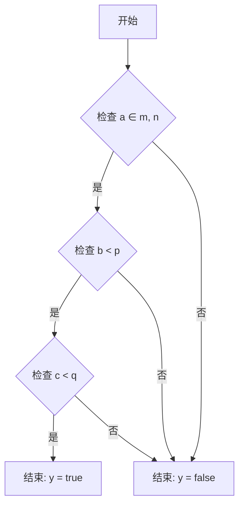

## Revision history

| Revision |    Data    | Description        |
| :------: | :--------: | ------------------ |
|    A     | 2023.08.23 | Initialize release |

## Sub-Feature

1. 跟手性
   1. 调整zoomratio
   2. 调整master id
   3. 不足：目前mtk只能zoom-in的时候使能，zoom-out时候p1裁剪受限，无法pre-ctrl
2. ZoomAnimation

## SensorCtrl

![[sat 2025.excalidraw#^frame=lens_switch|900]]

## ZoomAnimation

### Usecase 设计

### 架构设计

#### 当前的拍照预览FLow

![[sat 2025.excalidraw#^frame=current_preview_flow|Current Preview|1000]]

#### Capture Bokeh Preview

![[sat 2025.excalidraw#^frame=capture_bokeh_preview|Capture Bokeh Preview|1000]]

- 确认目前是已经支持dual-tuningFlow

#### New Flow

1. Full Pipeline ![[sat 2025.excalidraw#^frame=full_pipeline|Full Pipeline|1000]]
2. ab enabled ![[sat 2025.excalidraw#^frame=ab_enabled|Alpha Blending Enabled|1000]]
3. ab disabled ![[sat 2025.excalidraw#^frame=ab_disabled|Alpha Blending Disabled|1000]]

### Details

#### SAT & EISV2

```cpp
// alpha blending related
#define MAX_ALPHABLENDING_FRAME_NUM 25

typedef enum {
 AlphaBlendingDefaut = 0,
 AlphaBlendingZooming,
 AlphaBlendingfallback,
 AlphaBlendingAnimation
} AlphaBlendingState;

MUINT m_alphaBlendingState = 0; // 0:default, 1:zooming, 2:fallback, 3:zoomanimation
MBOOL m_enableAlphaBlending = MFALSE;
MBOOL m_bypassAlpaBlending = MTRUE;
MBOOL m_cancelAlphaBlending = MFALSE;
MBOOL m_runAlphaBlendingDone = MFALSE;
MUINT32 m_alphaBlendingCount = 20;

// zoom animation related
#define SAT_ZOOMANIMATION_ISZ_DELAY       15
#define SAT_ZOOMANIMATION_MIN_FRAMENUMS    (NORMALLY_PIPEINE_DELAY + 2)
#define SAT_ZOOMANIMATION_MAX_FRAMENUMS    14
#define ZOOMANIMATION_FOLLOWFINGER_MIN_SUB 0.2
typedef enum { DYNAMIC_SWITCH, ONLY_BEZIER, ONLY_POWEXP } SatZoomAnimationSwitch;
MUINT32 indexZoomAnimation = 0;
MUINT32 maxNumZoomAnimation = 0;
MBOOL isHwZoomAnimationIn = MFALSE;
```

#### fallback逻辑



#### fusionNode 的设计

#### SAT Node change

![[sat 2025.excalidraw#^frame=2_in_2_out|700]]

## Algo Pipeline

![[cv 2025.excalidraw#^frame=sat_pipeline|200]]