Space+Time(Geometry+Motion)

Structure from Motion  
- input: 多帧图像或视频
- output: 三维结构和相机运动
	- a 3-D reconstruction of the object of all images => pose
	- the reconstructed intrinsic and extrinsic camera parameters of all images => sparse 3D

```mermaid
flowchart LR
    %% ======================
    %% 数据输入层
    %% ======================
    A[Sensor输入<br>RAW / YUV / IMU] --> B[特征提取<br>ORB / FAST / Corner]

    %% ======================
    %% SFM 层（离线 / 高精度）
    %% ======================
    B --> C[特征匹配<br>Frame ↔ Frame]
    C --> D[几何估计<br>E/F矩阵 + R/T]
    D --> E[三角化<br>Sparse 3D Points]
    E --> F[Bundle Adjustment<br>全局优化]

    F --> G[SFM输出<br>相机轨迹 + 稀疏点云]

    %% ======================
    %% SLAM 层（实时化）
    %% ======================
    G --> H[SLAM初始化]
    B --> H

    H --> I[Tracking<br>实时位姿估计]
    I --> J[Local Mapping<br>局部建图]
    J --> K[Loop Closure<br>闭环检测]
    K --> L[Pose Graph优化]

    L --> M[SLAM输出<br>实时相机轨迹 + 稀疏/半稠密地图]

    %% ======================
    %% 手机相机算法层
    %% ======================
    M --> N[EIS模块<br>运动估计 + 平滑]
    M --> O[多帧对齐<br>Frame Alignment]
    M --> P[深度估计<br>Structure / Motion cues]

    %% EIS
    N --> N1[IMU融合<br>Gyro + Vision]
    N1 --> N2[轨迹平滑<br>滤波 / 优化]
    N2 --> N3[Warp / 裁剪输出稳定视频]

    %% 多帧融合
    O --> O1[参考帧选择]
    O1 --> O2[运动补偿<br>Global / Mesh Warp]
    O2 --> O3[多帧融合<br>HDR / MFNR / SuperRes]

    %% 深度
    P --> P1[视差估计]
    P1 --> P2[深度图生成]

    %% ======================
    %% 输出
    %% ======================
    N3 --> Z[稳定视频输出]
    O3 --> Z
    P2 --> Z
```

![[sfm 2026.excalidraw|100]]
## SIFT

Scale-Invariant Feature Transform
> 负责完成 feature extraction & feature matching

keypoint -> descriptor -> matching -> correspondence

descriptor: 对keypoint 周围的图片问题的向量描述

| 阶段     | 内容                                 | 颜色     |
| ------ | ---------------------------------- | ------ |
| Step 1 | 尺度空间构建：Gaussian金字塔 → 相减 → DoG金字塔   | 蓝色系    |
| Step 2 | 关键点检测：3层DoG中26邻域极值比较               | 绿色系    |
| Step 3 | 关键点精确定位：Taylor展开 → 低对比度滤除 → 边缘响应滤除 | 黄色/橙色系 |
| Step 4 | 方向分配：梯度采样 → 36-bin方向直方图 → 主方向      | 紫色系    |
| Step 5 | 描述符生成：4x4子区域 × 8方向 = 128维向量        | 红色/绿色系 |

![[sift.excalidraw| 1000]]
