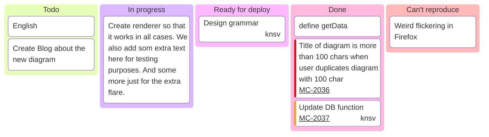

![[welcome.svg|PASSION|800]]

## Intro

### File structure

| Index | Name         | Desc                                              |
| ----- | ------------ | ------------------------------------------------- |
| 01    | [[life]]     | Summary of various knowledge and insights in life |
| 02    | [[work]]     | Summary of common knowledge related to work       |
| 03    | [[tools]]    | Some tools to improve efficiency                  |
| 10    | [[archived]] | Docs that be archived                             |

## Kanban

