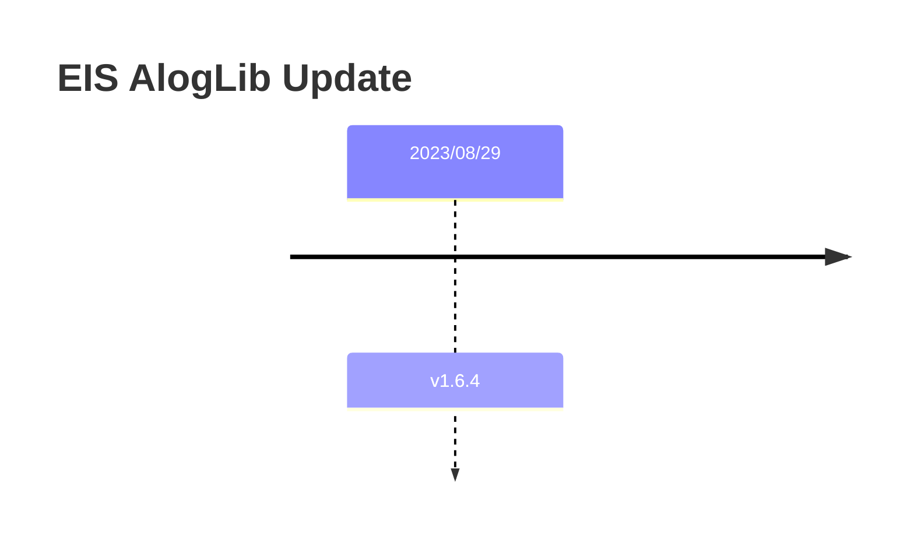

> 介绍项目过程中N11A相关信息和重要的问题记录

## 1. 项目信息

### 1.1. 文档汇总

- [N11A下载&编译&基线](https://xiaomi.f.mioffice.cn/docx/doxk4zxvckLfVChWC6s48Vp3OLh)
- [N11A-压测apk安装 & sanity自测](https://xiaomi.f.mioffice.cn/docx/doxk4Ic6wS6QlzKekhiZ2JlTXeg)
- [N11A相关合入的code](https://xiaomi.f.mioffice.cn/wiki/wikk4wPXCtEczSGllwEjv2DI1Gg?table=tbl1z0MS4BGmsqKq&view=vew7zPGYpJ)
- [Sensor Mode 规划汇总](https://xiaomi.f.mioffice.cn/file/boxk4hcJuMc3QO3zI2nrZZGeQ0c)
- [N11A-压测apk安装 & sanity自测](https://xiaomi.f.mioffice.cn/docx/doxk4Ic6wS6QlzKekhiZ2JlTXeg)
- [功能自检](https://xiaomi.f.mioffice.cn/sheets/shtk4GEEd0SoaRzJmq4q2O5oFCd)

### 1.2. 基本描述

1. 平台信息：MT6897
2. 编译：

    ```bash
    # 生成vendor.img 等文件
    source build/envsetup.sh
    export OUT_DIR=out/out_hal && lunch mivendor_mt6897_cn-user
    make mivendor_images -j24 2>&1 | tee build.log
    ```

3. 覆盖版本：CN/IN/EU, K70E
4. 模组信息：
    - [Sensor Mode 规划汇总](https://xiaomi.f.mioffice.cn/file/boxk4hcJuMc3QO3zI2nrZZGeQ0c)
5. N11A拿到的sp正式patch, 需先合入`base-u-mtk-t-alps-release-u0.mp1.tc8sp1-V1`, 无需CI

### 1.3. EIS算法库更新



## 2. 重要问题记录

### 延时摄影场景成片短

2023.09.05
- 关键字: `tripodVal`
- 曝光时长
- 9993750
- 159997500
- 399 993750 有问题
目前分析是eis-flush阶段的25帧数据没有送到video那边做codec
- 目前eis端数据处理正常
- 需要平台端进一步分析

2023.09.06
- 补充的log:

```bash

adb shell setprop vendor.debug.camera.log.ACallbackAdaptor 1

adb shell setprop vendor.debug.camera.log.MtkCallbackAdaptor 1

```

2023.09.14
- 目前确认高通机型是正常的

### tuning app name 的修改

```log

10-18 13:59:38.027 24480 28557 D ae_mgr_v4l2: [AE_NVRAM][0] [AE][DB] key:Sensor(0x5664)/db_SensorIDAE 22116 db_AppIDAE 38 db_ActionIDAE 0 db_FlashIDAE 0 db_ProjectIDAE0 db_FeatureIDAE 28 db_SensorFeatureIDAE 0 db_CustomFeatureIDAE 34 db_CustomIDAE 0 db_SensorModeIDAE 0 db_FPSIDAE 0 db_CameraModuleIDAE 5 db_CustomFeature2IDAE 0 ae_group_ParamID 501 ae_grouppline_ParamID 501

```

1. app name csv 路径: `xiaomi_tuning/mt6897/duchamp_cn/db/csv/db_App.csv`
1. 具体修改路径: `mtkcam-custom/policy/featuresetting/FeatureSettingPolicy_Streaming_Custom.cpp`
1. 文件匹配目录: `mtkcam-custom/atms/MiMapX2MappingInfo.cpp`
