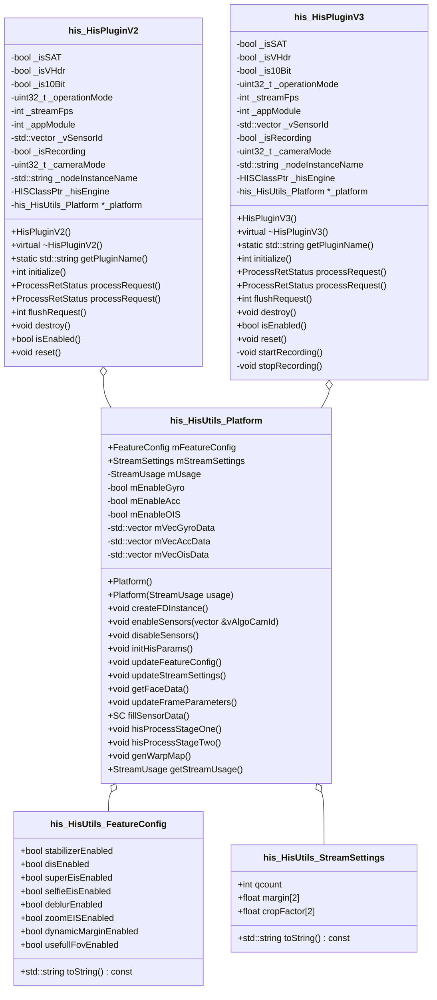

## MIVI 3.0

### 问题

1. 电影画幅接在什么地方
1. zoom场景下, 是否始终在结尾放一个VSE
1. eis60帧缓存, hbm的适配工作
1. colorspace 需要在video场景下配置为bt709
1. FD拿地不准确, 与万物追焦有关`pipeline/hwnode/DetectNode/fd/FDProcessor.cpp`

### N11A调试步骤

1. Feature-8035分支 <https://bbm.pt.miui.com/tasks/8035>
1. 最新corgi-ROM: [1353115](https://tools.bsp.xiaomi.com/flash?id=1353115&type=test&isPangu=true)
1. 代码提交记录
    - [MIVI-EIS](https://gerrit.pt.mioffice.cn/q/topic:MIVI_EIS)
    - [MIVI_EIS_FRAMEDELAY](https://gerrit.pt.mioffice.cn/q/topic:MIVI_EIS_FRAMEDELAY)
    - [INLINE_FLOW](https://gerrit.pt.mioffice.cn/q/topic:DUCHAMP-9781)

### N11A调试中的问题

1. 额外使用的mtk库需要修改目录

    需要注释掉 `LOCAL_PROPRIETARY_MODULE` 来保证so生成在ODM

    ```cpp
    include $(CLEAR_VARS)
    LOCAL_MULTILIB      := 64
    LOCAL_SRC_FILES_arm64  := libcam.utils.sensorprovider.so
    LOCAL_MODULE        := libcam.utils.sensorprovider
    LOCAL_MODULE_SUFFIX := .so
    LOCAL_MODULE_TAGS   := optional
    LOCAL_MODULE_CLASS  := SHARED_LIBRARIES
    LOCAL_CHECK_ELF_FILES := false
    # LOCAL_PROPRIETARY_MODULE := true
    LOCAL_MODULE_PATH := $(TARGET_OUT_ODM)/lib64/temp
    include $(MTKCAM_BUILD_PREBUILT)
    ```

1. 开启inplace时候, 需要调用`ProcessRequestInfoV2`

### M12调试步骤

1. 增加Feature-6605分支 <https://bbm.pt.miui.com/tasks/6605>
1. 开启streaming上移功能:
    1. `odm/config/mihal/mtk/corot/overridesettings.json` 中supportStreaming设为true
    1. 将json push到`vendor/etc/camera/xiaomi/`
1. CorgiID:`1230483`, cp相关的code
1. debug
    1. so `vendor/lib64/camera/plugins`
    1. json `vendor/etc/camera/xiaomi`
1. node设置为inplace格式

    ```json
    {
        "NodeName": "com.xiaomi.plugin.mihis",
        "NodeInstance": "HISInstance0",
        "NodeProperty": [
            {
                "NodePropertyName": "NodeMask",
                "NodePropertyValue": 1
            }
        ]
    },
    ```

    > mialgoengine/MiaNode.h

    ```cpp
	// input buffer as to output buffer
	static const uint32_t INPLACE_MODE = (1 << 0);
	// support multithreading concurrency
	static const uint32_t CONCURRENCY_MODE = (1 << 1);
	// support scale process
	static const uint32_t SCALE_MODE = (1 << 2);
	// support frame by frame get input image
	static const uint32_t SIGGETOUTPUT_MODE = (1 << 3);
	// support frame by frame processing
	static const uint32_t SIGFRAME_MODE = (1 << 4);
	// support frame by frame release inputImage after use
	static const uint32_t SIGRELEASEINPUT_MODE = (1 << 5);
	// support frame by frame release outputImage after use
	static const uint32_t SIGRELEASEOUTPUT_MODE = (1 << 6);
	// output size determined by node
	static const uint32_t CUSTOMSIZE_MODE = (1 << 7);
	// support request output buffer delay
	static const uint32_t SIGREQUESTBUFFERDELAY_MODE = (1 << 8);
	// virtual node, do one outputport buffer to more childNode
	static const uint32_t VIRTUAL_MODE = (1 << 9);
	// as an internal node,but get outputbuffer from External
	static const uint32_t VIRTUAL_SINKNODE = (1 << 10);
	// software yuv2jpeg
	static const uint32_t YUV2JPEG_MODE = (1 << 11);
	// close boost cpu in mialgoengine
	static const uint32_t ClosePerfLock_MODE = (1 << 12);
	// Wait for N frames to be processed before returning the first frame process result
	static const uint32_t VIDEOUP_MODE = (1 << 13);
	// node output buffer is cpu noCache
	static const uint32_t NOCACHE_MODE = (1 << 14);
	// hal Node
	static const uint32_t HAL_MODE = (1 << 15);
	// preview need sort request
	static const uint32_t SORTPIPELINE_MODE = (1 << 16);
	// when the next node is not frame-by-frame but needs to be woken up
	static const uint32_t NOTIFYNOSIGFRAME_MODE = (1 << 17);
    ```

1. wep需要裁剪pipeline
    `vendor/mtk/MiaCustomizationInfo/MtkPrunerCustomization.cpp`
1. 设置log等级
    `adb shell setprop persist.vendor.camera.mivi.loglevel 3`
    
| Num | Level |
| --- | ----- |
| 2   | V     |
| 3   | D     |
| 4   | I     |

### M12调试中的问题

1. mtk文件中, LOCAL_SHARED_LIBRARIES 需要加上算法库
1. mtk的库来源于vendor分区

    ```cpp
    LOCAL_MODULE := com.xiaomi.plugin.mihis
    LOCAL_MODULE_TAGS := optional
    LOCAL_VENDOR_MODULE := true
    LOCAL_MULTILIB := 64
    include $(MTKCAM_SHARED_LIBRARY)
    ```

    odm/plugins/mtk/common/pangu_decouple/Android.mk
    这个路径中需要添加用到的mtk库, 其中末尾一行是`include $(MTKCAM_BUILD_PREBUILT)`
1. FD获取 #fd
    - 源FDContainer数据 [MTK](https://source-t.dun.mi.com/opengrok-t/xref/mivendor_t_mt6985/vendor/mediatek/proprietary/hardware/libcamera_feature/libfdft_lib/libcamalgo.fdft/include/faces.h)
        - Bounds of the face [left, top, right, bottom]

### log关键字

1. 模块
   - MiCamService
   - MiCamHAL
     - VendorCameraSession
        - Session.cpp
        - CameraMode.cpp
        - Previewer.cpp
   - MiAlgoEngine
   - MiCamAdapter
1. 时域
    - configurestreams
    - buildGraph
    - rebuildLinks

### 模块架构

1. AidlCameraDeviceSession: 将FW信息转换为xiaomi-Hal
1. 小米相机HAL: 控制xiaomi-Hal的业务逻辑
    - VendorCameraSession
        1. SyncAlgoSession (For SDK & Extension)
        1. ASyncAlgoSession (For MiuiCamera)
            - CameraMode
                1. Previewer
                1. Photographer
        1. MockCameraSession (控制拍照返回大图的逻辑)
        1. PostProcessorManager
        1. PostProcessor: 将xiaomi-Hal传递到算法架构
        1. Mialgoengine
1. AdapterDeviceSession: 将xiaomi-Hal转换为mtk-Hal

问题:

- SAT的架构, 先降噪, 后过算法

### 时序

1. configure
    1. configure_streams
    1. buildConfigToVendor
    1. createStreamingDarkroom
    1. configureStreams
2. process

### Plugin

- string getPluginName()
- int    initialize()
- ProcessRetStatus processRequest() 两种函数
- int    flushRequest()
- bool   isEnabled()
- void   destroy()

## EIS

- 依赖点
  - sensorProvider
  - eisMargin
    - `void HWProcPlugin::customizeOutBufferFormats`

1. 添加Plugin
    1. 添加动态库
        - `/vendor/xiaomi/proprietary/mivifwk/odm/odm_mtk.mk`
        - `com.xiaomi.plugin.mihis`
    1. 添加算法Android.mk
        - `vendor/xiaomi/proprietary/mivifwk/odm/plugins/mtk/Android.mk`
        - `include $(ALGO_PLUGINS_PATH)/mihis/Android.mk`
1. 修改json文件
    1. 准备json文件
        - `odm/config/pipeline/mtk/corot/satpreview.json`
    1. 添加读取json的code
        - `vendor/xiaomi/proprietary/mivifwk/mialgoengine/MiaOfflineSession.cpp`

        ```cpp
        if (params->processMode == MiaPostProcMode::RealTimeVideo) {
            if (params->operationMode == StreamConfigModeMiuiVideo) {
                strcpy(filename, "/odm/etc/camera/xiaomi/normalvideo.json");
            }
        }
        ```

    1. 添加json文件
        - `/vendor/xiaomi/proprietary/mivifwk/odm/odm_mtk.mk`

        ```cpp
        PRODUCT_PACKAGES += \
            tprearbokehsnapshot.json \
            tpfrontsnsnapshot.json \
            tprearsnsnapshot.json \
            tpfrontnormalsnapshot.json \
            tprearnormalsnapshot.json  \
            ellc_params.json \
            satpreview.json
        ```

    1. jsoncreate图形化工具
        - [gitlab](https://git.n.xiaomi.com/wangzhen14/jsoncreate)

### Class



### WPE

- VSE的类型设置

```cpp
/**
 * The enumeration enumerates possible value of
 * `::MTK_POSTPROCDEV_WPEPQ_FEATURE_CONTROL`.
 * See each enumerator for detail explanations.
 */
typedef enum mtk_camera_metadata_enum_postprocdev_wpepq_feature {
  /**
   * Feature Default: Default value is set if no user setting.
   *  @note Default behavior is backward compatible. If warp map is setup at
   *  configure, wpe hardware device will be set up with PQDIP hardware device;
   *  if not, only PQDIP hardware device will be setup.
   *  @note Warp Map stream can be set up by either by a warp map stream or tag
   *  `::MTK_POSTPROCDEV_WPEPQ_WARPMAP_SIZE` at configure.
   */
  MTK_POSTPROCDEV_WPEPQ_FEATURE_DEFAULT = 0,

  /**
   * Feature WPE.
   *  @note only wpe hardware device will be setup. Any other functionalities
   *  that are provided by PQDIP hardware device are unavailable.
   *  @note regular-used functionalities provided by wpe hardware device:
   *    1. warp: apply given warp map;
   *    2. resize: resize the image after warping to fit in the size of output
   *       stream (no need to set `::MTK_POSTPROCDEV_WPEPQ_WPE_OUTPUT_SIZE`).
   *       User should notice that wpe hardware device is not specialized in
   *       resizing, so there may be limited performance in dealing with severe
   *       work of resizing. E.g. big difference in the size of input and output
   *       image.
   *  @note changing image format is not supported for wpe hardware device.
   */
  MTK_POSTPROCDEV_WPEPQ_FEATURE_WPE,

  /**
   * Feature PQDIP.
   *  @note only PQDIP hardware device will be setup. Any other functionalities
   *  that are provided by wpe hardware device are unavailable.
   *  @note regular-used functionalities provided by PQDIP hardware device:
   *    rotate, flip, crop, and resize.
   */
  MTK_POSTPROCDEV_WPEPQ_FEATURE_PQDIP,

  /**
   * Feature WPE and PQDIP.
   *  @note both wpe and PQDIP hardware devcie will be setup.
   */
  MTK_POSTPROCDEV_WPEPQ_FEATURE_WPE_PQDIP,
} mtk_camera_metadata_enum_postprocdev_wpepq_feature_t;
```

- WARPMAP相关配置

```cpp
/**
 * Describe the size of Warp Map.
 *  @par Type
 *       int32_t[]
 *  @par Valid Timing
 *       Configure
 *  @par Unit
 *       Pixel in main source image
 *  @par Value
 *       - [0]: Width
 *       - [1]: Height
 *  @par Note
 *       In order to use the capability of WPE device, user should either
 *       config a warp map stream, or use
 *       `::MTK_POSTPROCDEV_WPEPQ_WARPMAP_SIZE` to set the size of warp map.
 *       The width of warp map needs 2 pixel alignment and while using this
 *       tag to hint warp map information and setting warp map content by
 *       `::MTK_POSTPROCDEV_VSE_WARPMAP_SIZE`, it will cost additional CPU
 *       MIPs to copy content to hardware buffer.
 */
MTK_POSTPROCDEV_WPEPQ_WARPMAP_SIZE,

/**
 * Describe the content of Warp Map.
 *  @par Type
 *       int32_t[]
 *  @par Valid Timing
 *       Per-frame
 *  @par Value
 *       - [0]:    4-byte warp map content, x-plane: 1st part.
 *       - [1]:    4-byte warp map content, x-plane: 2nd part.
 *       - ...
 *       - [N-1]:  4-byte warp map content, x-plane: Nth part.
 *       - [N]:    4-byte warp map content, y-plane: 1st part.
 *       - [N+1]:  4-byte warp map content, y-plane: 2nd part.
 *       - ...
 *       - [2N-1]: 4-byte warp map content, y-plane: Nth part.
 *  @par Note
 *       The value of N is expected to be: N = width x height. User who sets
 *       `::MTK_POSTPROCDEV_WPEPQ_WARPMAP_SIZE` at config time is able to fill
 *       warp map content by `::MTK_POSTPROCDEV_WPEPQ_WARPMAP_CONTENT` per
 *       request. WPE device need copy content data of warp map to hardware
 *       buffer.
 */
MTK_POSTPROCDEV_WPEPQ_WARPMAP_CONTENT,
```

### 缓存帧

- MTK方案
TPINode.cpp 中的 mTPIQueue

## VideoNight

### 相关port

- 依赖点
  - in/out 均为 MIPI 12bit
- DX-2 ISP架构
![[assets/images/mivi 2024-03-22 16.51.47.excalidraw.md#^frame=zYFJ8L9LMFKK0qKA3GzIW|800]]

  - P1的出图点
	- A: Pure raw
	- B: Process raw (BPC后)
	- C: Process raw (LTM后)
	- D: P1 YUV

	```bash
	adb shell setprop vendor.debug.preprocsession.customhint 14 # after BPC
	adb shell setprop vendor.debug.preprocsession.customhint 15 # after LTM
	```


	```cpp
	enum class MainStreamPathControl : uint8_t {
	  UNPROCESSED = 0,
	  AFTER_BPC,
	  AFTER_FRZ,
	  AFTER_FUS,
	  AFTER_DGN,
	  AFTER_LSC,
	  AFTER_HLR,
	  AFTER_LTM,
	  FULLY_PROCESSED = AFTER_LTM,
	};
	
	// MTK_POSTPROC_VSE_AVAILABLE_FEATURES
	typedef enum mtk_camera_metadata_enum_postprocdev_vse_available_features {
	  /** Indicates invalid feature */
	  MTK_POSTPROCDEV_VSE_AVAILABLE_FEATURES_NONE = 0x0000,
	
	  /** Motion Compensation Noise Reduction for streaming. */
	  MTK_POSTPROCDEV_VSE_AVAILABLE_FEATURES_YUVMCNR = 0x0001,
	
	  /**
	   * Low latency MCNR cannot be per frame enabled/disabled and conflict
	   * with other features.
	   */
	  MTK_POSTPROCDEV_VSE_AVAILABLE_FEATURES_YUVMCNR_LOW_LATENCY = 0x0002,
	  /**
	   * Use XTRAW to process raw and split multiple yuv out
	   */
	  MTK_POSTPROCDEV_VSE_AVAILABLE_FEATURES_RAW_SPLITTER = 0x0003,
	  /**
	   * Use offline pipeline to support raw-in -> streaing yuv out
	   */
	  MTK_POSTPROCDEV_VSE_AVAILABLE_FEATURES_TK_STREAMING = 0x0004,
	
	  /**
	   * Feature to calculate Motion Map using platform accelerator.
	   *  @version Added in Metadata Tag v1.1.
	   */
	  MTK_POSTPROCDEV_VSE_AVAILABLE_FEATURES_HWME = 0x0005,
	} mtk_camera_metadata_enum_postprocdev_vse_available_features_t;
	```

### Porting

1. imagrFormat

- openGrok: <https://source-u.dun.mi.com/opengrok-u/xref/mivendor_u_mt6897/vendor/mediatek/proprietary/hardware/mtkcam/include/mtkcam/def/ImageFormat.h#237>
- `eImgFmt_BAYER12_UNPAK`
- M12 patch
  - mtkcam-android: <https://gerrit.pt.mioffice.cn/c/quark/mtkcam-android/+/3457529>
  - mivifwk: <https://gerrit.pt.mioffice.cn/c/platform/vendor/xiaomi/proprietary/mivifwk/+/3456097>
  - algo-mivifwk: <https://gerrit.pt.mioffice.cn/c/platform/vendor/xiaomi/proprietary/mivifwk/+/3380697>
- N11A patch
  - [mivi-patch](https://gerrit.pt.mioffice.cn/q/topic:MIVI3_NIGHTVIDEO)
  - [algo-patch](https://gerrit.pt.mioffice.cn/q/topic:MIVI_VIDEO_NIGHT)

## Framework

### MIVI Fwk

![[assets/images/mivi 2024-03-22 16.51.47.excalidraw.md#^frame=mDbmXc_EHtJBp8f7OtHZl|800]]

### Capture

![[assets/images/mivi 2024-03-22 16.51.47.excalidraw.md#^frame=EoeMrDj2vJBIFziuX3ZXn|800]]

![[assets/images/mivi 2024-03-22 16.51.47.excalidraw.md#^frame=wSOXh5pVMEMCqvUuDFGDX|800]]

## Camera Id 相关知识总结

| Name               | Desc              |
| ------------------ | ----------------- |
| logical camera id  | app下发的id(含三方app)  |
| camera mode        | mivi 使用的id        |
| role id            | qcom/mtk hal使用的id |
| physical camera id | 物理硬件配置的id         |

## 参考文档

- [Mivi3 预览、录像算法上移集成事宜](https://xiaomi.f.mioffice.cn/docx/doxk4ecFEdIXgGIkfkfRYR6x8ob)
- [平台数据获取——PlatformInfoHolder](https://xiaomi.f.mioffice.cn/docx/doxk4eb0MhaQlcGWHcdlNaJv4Ue)
