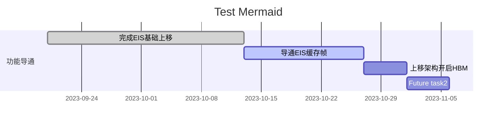
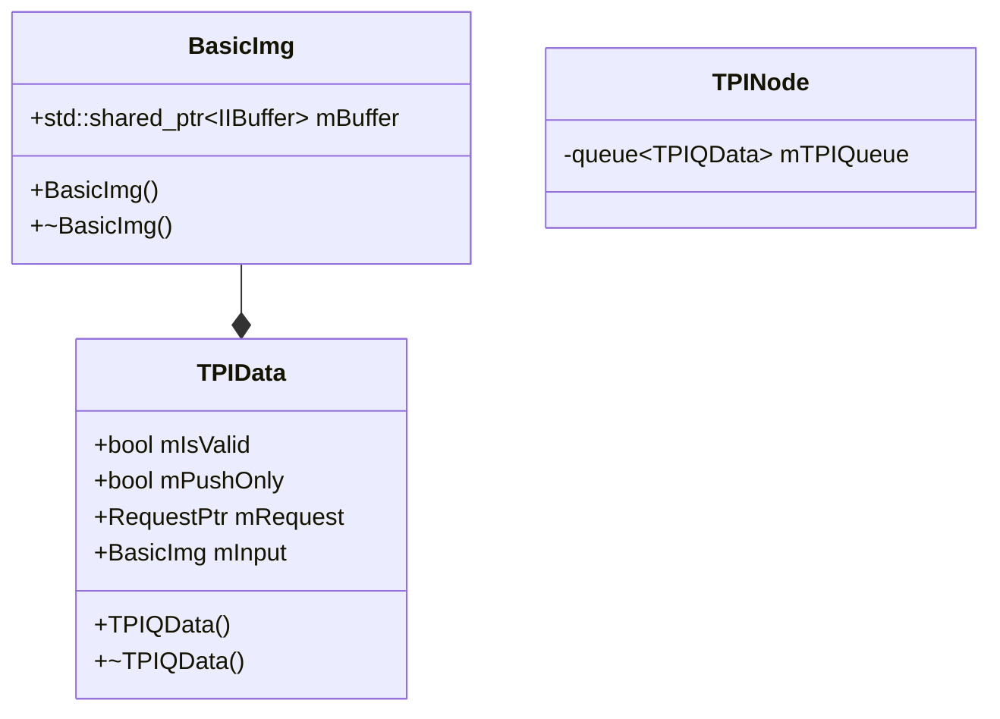

- [XM MTK平台相机预研规划项](https://xiaomi.f.mioffice.cn/sheets/shtk477TKjpUzmBeEH0aLTcwePh?sheet=9c2UEe)
- [MTK-EIS 60帧缓存](https://xiaomi.f.mioffice.cn/wiki/wikk470aCGTi2P44OdQMZnhQbOh)

## Flow

![[assets/images/60q 2024-03-22 15.38.55.excalidraw.md#^frame=haPGwpaiD3-kG0dSfA7-0|600]]

---
![[assets/images/60q 2024-03-22 15.38.55.excalidraw.md#^frame=-PBvpQ-1WAuKkUUHZiLpN|700]]

![[assets/images/60q 2024-03-22 15.38.55.excalidraw.md#^frame=rfdPj-CifsLm3DC8Mb6F-|700]]

---

## HBM

- android tag: `MTK_INFO_SUPPORTED_BUFFER_MANAGEMENT_VERSION`
- hal core tag:
  - `MTK_HALCORE_SUPPORT_HAL_BUFFER_MANAGEMENT`

strategy: Preparatory/Immediate/Cached

![[assets/images/60q 2024-03-22 15.38.55.excalidraw.md#^frame=conQMqABt5iA58etfi4NR|Schematic diagram of Preparatory Strategy|600]]

Preparatory: request一下去就申请buffer
Immediate: 检测到没有带appOutBuffer, 就会立即去拿buffer

填写app-buffer的位置是哪儿? MTK-HAL

producer & confumer 总的限制为64块

FHD下面增量为2-3 mips
