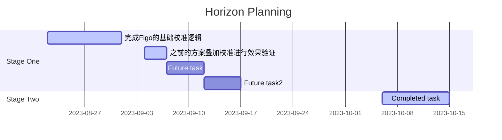

## 工作规划



## 先前工作内容

- [基础功能预研](https://xiaomi.f.mioffice.cn/wiki/wikk4VBbFDP1lt5DLseF3jrcs9U)
- [遗留问题梳理](https://xiaomi.f.mioffice.cn/wiki/wikk4BpbLLsohyndWHsbtgqRcqd)
- [论文学习](https://xiaomi.f.mioffice.cn/wiki/wikk4VBeqwSr7juUNi5VhzGfszD)
- [相机模型学习](https://xiaomi.f.mioffice.cn/wiki/wikk4aDDt4h2OwyypSqTtF73mvh)
- GitLab: <https://git.n.xiaomi.com/matao3/horizon>

## GPU

[GPU 优化技术-OpenCL 介绍](https://zhuanlan.zhihu.com/p/447456123)

- GPU (Graphics Processing Unit) 图形处理器
- CUDA (Compute Unified Device Architecture) 统一计算架构
- GPGPU(General-Purpose computing on Graphics Processing Units) 专注于通用并计算能力的GPU
- PC: NVIDIA & AMD
- Mobile: Qcom-Adreno GPU & ARM-Mali GPU

## Question

1. eof, sof, exp, 校准代码调整为输出ts-interval
1. 绘制生成的角度的变换曲线, 完全match
1. 考虑skew, 优化校准效果

## Gravity数据学习

[Android-Source](https://source.android.google.cn/docs/core/interaction/sensors/sensor-types?hl=zh-cn#gravity)

- 手机坐标轴
![[2023-08-30-20-38-21.png|手机坐标轴|200]]
- 输出的数据
  - 报告设备坐标系中重力的方向和大小
  - 重力矢量分量在 `sensors_event_t.acceleration`, 单位是$m/s^2$
  - 设备静止时, 重力传感器和加速度计的输出相同. 地球的重力加速度为$9.8m/s^2$
  - 基于N11A实际验证
    1. 竖直放置时候, 值为(0, 9.8, 0)
    2. 竖直逆转$90^{\circ}$放置时候, 值为(9.8, 0, 0)
    3. 水平放置时候, 值为(0, 0, 9.8)

## Calibration

- 更改相关文件, 基于 [video_stab](https://github.com/lesialin/video_stab)
    1. 重要的cv函数
        - `cv2.goodFeaturesToTrack()`: 检测前一帧的特征点(角点)
        - `cv2.calcOpticalFlowPyrLK()`: 光流法跟踪特征点
        - `cv2.estimateAffinePartial2D()`: 四自由度的仿射变换, 输出是(dx, dy, dz)=>(x运动, y运动, z转角)
- code 运行命令:

    ```bash
    # 1. 录制mp4文件15s左右, 同步拉取出 mp4 & frameInfo(f-ts, exp) & gravityInfo

    # 2. 基于mp4文件生成 `motion_vector.log`
    python3 ~/Documents/video_stab/utility/gyro_video_time_alignment/run_video_motion_estimiation.py ~/Downloads/horizon_out

    # 3. 基于motion_vector & gravityData生成alignment
    python3 ~/Documents/video_stab/utility/gyro_video_time_alignment/run_motion_alignment.py ~/Downloads/horizon_out
    ```

- 校准注意事项
   1. 通过$arctan\frac{x}{y}$, 计算得出在垂直平面内的转角$\theta_{xy}$(顺时针方向为正方向), 单位为$rad$
   1. 通过$arctan\frac{z}{\sqrt{x^{2}+y_{2}}}$, 计算出手机的倾斜角度$\theta_{z}$, 单位为$rad$
   1. XXX 需要尽量保持远景, 这样被拍摄物体尽量是与x_y平面平行, 保证计算出的$\theta_{xy}$能够尽量与使用成片基于cv计算出的转角是同一个平面

## 在N11A 导通

- L2M-Patch: <https://gerrit.pt.mioffice.cn/c/quark/mtkcam-core/+/2377094>
- N11A-Patch: <https://gerrit.pt.mioffice.cn/c/quark/mtkcam-core/+/3322930>

1. 获取Gravity数据

- 通过event获取gravity数据
- 原始获取的数据的坐标系不符合右手定则, 需要将x,y,z方向的数值乘以(-1), 将完全符合上述的坐标系(含正方向)
![[2023-11-15-16-48-45.png|qis-hc360|600]]
## Reference

1. [知乎-OpenCV实现视频防抖技术](https://zhuanlan.zhihu.com/p/250839967https://zhuanlan.zhihu.com/p/250839967)
1. [CSDN-视频稳像或防抖](https://blog.csdn.net/XDH19910113/article/details/109603434)
