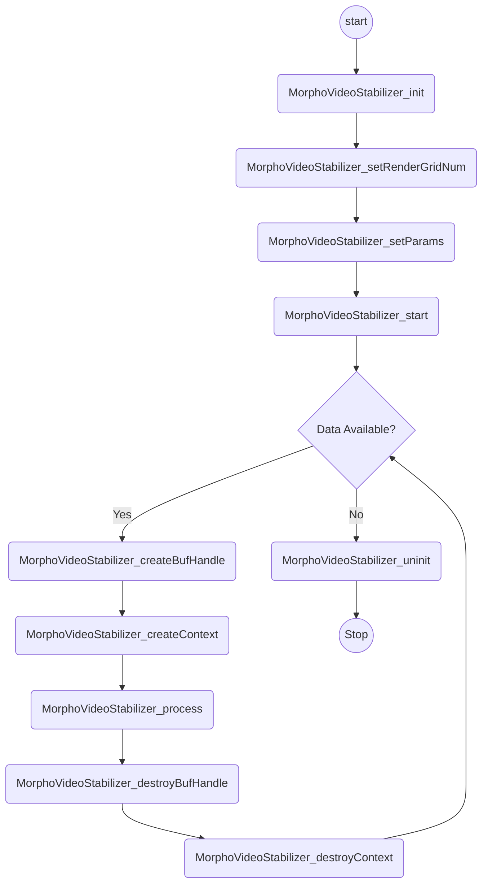

## Debug

```bash
adb shell "rm -rf /data/vendor/camera/eis/."
adb shell setprop debug.morpho.debug.enable 1
adb shell setprop debug.morpho.dump.path /data/vendor/camera/eis/
# dump 出 素材
adb shell setprop debug.morpho.dump.mask 3
# dump 出sensorData
adb shell setprop debug.morpho.dump.mask 16

adb pull data/vendor/camera/eis/.
```

## 软件数据流



## 状态

```cpp
/* Error code */
[[define]] MORPHO_OK                   ((int)0x00000000)  /**< Successful */
[[define]] MORPHO_INPROGRESS           ((int)0x00010000)  /**< Now in progress */
[[define]] MORPHO_CANCELED             ((int)0x00020000)  /**< Canceled */
[[define]] MORPHO_SUSPENDED            ((int)0x00080000)  /**< Suspended */

[[define]] MORPHO_ERROR_GENERAL_ERROR  ((int)0x80000000)  /**< General error */
[[define]] MORPHO_ERROR_PARAM          ((int)0x80000001)  /**< Invalid argument */
[[define]] MORPHO_ERROR_STATE          ((int)0x80000002)  /**< Invalid internal state or function call order */
[[define]] MORPHO_ERROR_MALLOC         ((int)0x80000004)  /**< Memory allocation error */
[[define]] MORPHO_ERROR_IO             ((int)0x80000008)  /**< Input/output error */
[[define]] MORPHO_ERROR_UNSUPPORTED    ((int)0x80000010)  /**< Unsupported function */
[[define]] MORPHO_ERROR_NOTFOUND       ((int)0x80000020)  /**< Is not found to be searched */
[[define]] MORPHO_ERROR_INTERNAL       ((int)0x80000040)  /**< Internal error */
[[define]] MORPHO_ERROR_TIMEDOUT       ((int)0x80000080)  /**< Timed out */
[[define]] MORPHO_ERROR_UNKNOWN        ((int)0xC0000000)  /**< Error other than the above */
```

## WPEMode问题

1. display flow 没有buffer下来，algo需要支持该情况
2. precoeeRecord 时有buffer，但buffer的format不符合
```log
06-20 22:01:03.837 27148 27647 D MORPHO_EIS_REC: [processRecord] MorphoRecordEIS processRecord +++
06-20 22:01:03.838 27148 27647 D MorphoVideoStabilizer: (MorphoVideoStabilizer_process)[686]: `src->buf_type == BUFFER_TYPE_HEAP || src->buf_type == BUFFER_TYPE_QCOM_UBWCTP10' is false.
06-20 22:01:03.838 27148 27647 D MORPHO_EIS_REC: [processRecord] MorphoVideoStabilizer_getRenderGrid 0x80000001
06-20 22:01:03.838 27148 27647 D MORPHO_EIS_REC: [genWarpMap] genWarpMap +++
06-20 22:01:03.838 27148 27647 E MORPHO_EIS_REC: matao this is aaa
06-20 22:01:03.838 27148 27647 E MORPHO_EIS_REC: matao the renderGridSize(0x0)
06-20 22:01:03.838 27148 27647 D MORPHO_EIS_REC: [genWarpMap] genWarpMap ---
06-20 22:01:03.838 27148 27647 E MORPHO_EIS_REC: [processRecord] MorphoVideoStabilizer_process failed 0x80000001 (processRecord){#1192:vendor/mediatek/proprietary/hardware/mtkcam-core/thirdparty/customer/mi_morpho_eis/morpho_eis_record.cpp}
06-20 22:01:03.838 27148 27647 D MORPHO_EIS_REC: [processRecord] zhuangxj in(2400x1352) rec=(2400x1352)
06-20 22:01:03.838 27148 27647 D MORPHO_EIS_REC: [printLog] EISQ Rec. In(0xb400007d4c0dbbd8) (2400x1352/43463729154080) InCrop(1.000,0.000, 3998.000x2252.000) TargetCrop(240.000,135.950, 1920.000x1080.099), out(2400x1352/43463729154080), outCrop(0.000,0.000,2400.000x1352.000)
06-20 22:01:03.838 27148 27647 D MORPHO_EIS_REC: [processRecord] MorphoRecordEIS processRecord ---
```