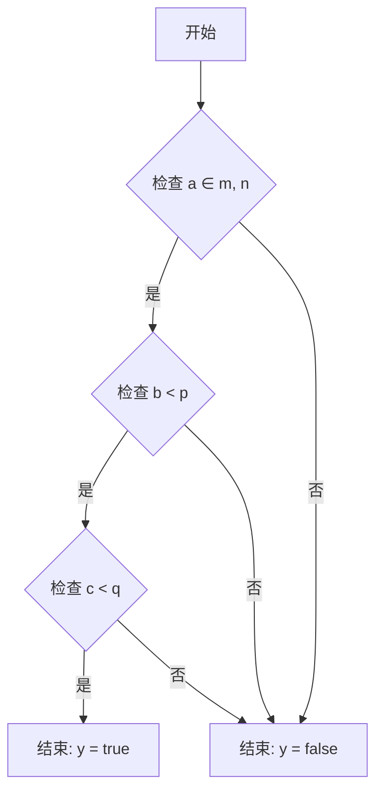

## Revision history
#sat 

| Revision |    Data    | Description        |
| :------: | :--------: | ------------------ |
|    A     | 2023.08.23 | Initialize release |

## Content


## Fallback

1. 输入
	1. 亮度
	2. 距离

## ZoomAnimation

### Usecase 设计


### 架构设计

#### 当前的拍照预览FLow

![[assets/images/sat 2024-09-15 17.55.14.excalidraw.md#^clippedframe=wKWZb_0OpmXOG83q6PJQW|current preview|1500]]
#### CaptureBokehPreview

![[assets/images/sat 2024-09-15 17.55.14.excalidraw.md#^clippedframe=DRccc_0fG3tXLXp-fS2Tb|bokeh preview|1500]]
- 确认目前是已经支持dual-tuningFlow
#### New Flow

![[assets/images/sat 2024-09-15 17.55.14.excalidraw.md#^clippedframe=pu3356wsrVpXbAnjHRHr5|full pipeline|1500]]
![[assets/images/sat 2024-09-15 17.55.14.excalidraw.md#^clippedframe=kGk4KYBl6_OtrLEODNDaf|alpha blending enabled|1500]]
![[assets/images/sat 2024-09-15 17.55.14.excalidraw.md#^clippedframe=fKADmdt_QFCVczw3Rss6K|ab disabled|1500]]

- SAT & EISV2

```cpp
// alpha blending related
#define MAX_ALPHABLENDING_FRAME_NUM 25

typedef enum {

    AlphaBlendingDefaut = 0,

    AlphaBlendingZooming,

    AlphaBlendingfallback,

    AlphaBlendingAnimation

} AlphaBlendingState;

MUINT m_alphaBlendingState = 0; // 0:default, 1:zooming, 2:fallback, 3:zoomanimation
MBOOL m_enableAlphaBlending = MFALSE;
MBOOL m_bypassAlpaBlending = MTRUE;
MBOOL m_cancelAlphaBlending = MFALSE;
MBOOL m_runAlphaBlendingDone = MFALSE;
MUINT32 m_alphaBlendingCount = 20;

// zoom animation related
#define SAT_ZOOMANIMATION_ISZ_DELAY       15
#define SAT_ZOOMANIMATION_MIN_FRAMENUMS    (NORMALLY_PIPEINE_DELAY + 2)
#define SAT_ZOOMANIMATION_MAX_FRAMENUMS    14
#define ZOOMANIMATION_FOLLOWFINGER_MIN_SUB 0.2
typedef enum { DYNAMIC_SWITCH, ONLY_BEZIER, ONLY_POWEXP } SatZoomAnimationSwitch;
MUINT32 indexZoomAnimation = 0;
MUINT32 maxNumZoomAnimation = 0;
MBOOL isHwZoomAnimationIn = MFALSE;
```

#### fallback逻辑


#### fusionNode 的设计


#### SAT Node change

![[assets/images/sat 2024-09-15 17.55.14.excalidraw.md#^clippedframe=JJqZyqA7D9aRce5a69XR6|sat node|1000]]