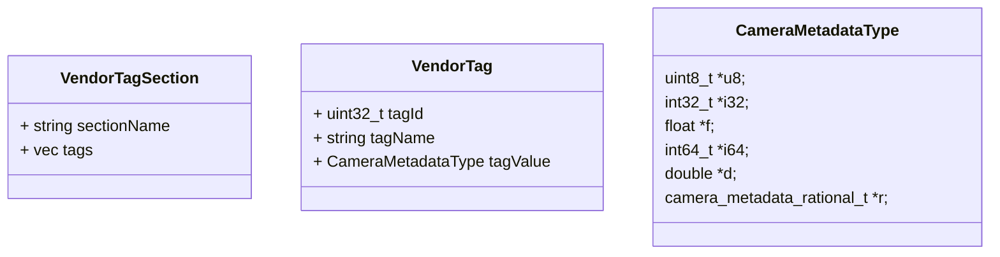

元数据是写给未来的情书。   - 杰森·斯科特

## 什么是VendorTag

『元（Meta）』可以理解为事物或对象，『数据（data）』是指该对象的相关数据，关于对象的一切信息都是元数据

- 什么是 Android-MetaData？
  - 目的：
    - 实现 camera hal3 的 per-frame control
  - 一块内存数据，包含对单帧图像的控制和描述信息，用 tagName+value 表示（类似 key-value）
  - 这块数据由多条 entry 组成，`<sectiobName>.<tagName>`

- Android Metadata Tags
- OEM Metadata Tags (vendor_section = 0x800)

类型:

1. Static (描述能力)
1. Control (设置请求)
1. Dynamic (实际生效)

![[metadata 2024-04-06 03.24.14.excalidraw|Metadata Type|800]]

### Partial meta

> performance considerations:
> Applications receive these partial results immediately, so sending partial results is a highly recommended performance optimization to > avoid the total pipeline latency before sending the results for what is known very early on in the pipeline.

- 性能原因
- 实时性原因, 部分数据需要提前返回

## 操作VendorTag

- 步骤
  - 定义Key
  - 确认数据类型
  - 调用get/set方法

### 相关定义

Android metadata 源码路径：`system/media/camera/`

- MetaData 层次结构定义及 基本宏定义 /system/media/camera/include/system/camera_metadata_tags.h
- MetaData 枚举定义及常用API 定义 /system/media/camera/include/system/camera_metadata.h
- MetaData 基本函数操作结构体定义 /system/media/camera/include/system/camera_vendor_tags.h
- MetaData 宏定义与字符串绑定 /system/media/camera/src/camera_metadata_tag_info.c
- MetaData 核心代码实现 /system/media/camera/src/camera_metadata.c

### 内存分布

1. 区域一 ：何存camera_metadata_t 结构体定义，占用内存 96 Byte
1. 区域二 ：保留区，供未来使用
1. 区域三 ：何存所有 Tag 结构体定义，TAG[0]、TAG[1]、…、TAG[entry_count-1]
1. 区域四 ：剩余未使用的 Tag 结构体的内存保留，该区域大小为 (entry_capacity – entry_count) 个TAG
1. 区域五 ：所有 Tag对应的具体 metadata 数据
1. 区域六 ：剩余未使用的 Tag 占用的内存

```cpp
// system/media/camera/src/camera_metadata.c

/**
 * A packet of metadata. This is a list of entries, each of which may point to
 * its values stored at an offset in data.
 *
 * It is assumed by the utility functions that the memory layout of the packet
 * is as follows:
 *   |-----------------------------------------------|
 *   | camera_metadata_t                             |  区域一 ：何存camera_metadata_t  结构体定义
 *   |                                               |
 *   |-----------------------------------------------|
 *   | reserved for future expansion                 |  区域二 ：保留区，供未来使用
 *   |-----------------------------------------------|
 *   | camera_metadata_buffer_entry_t #0             |  区域三 ：何存所有 Tag 结构体定义
 *   |-----------------------------------------------|          TAG[0]、TAG[1]、.....、TAG[entry_count-1]
 *   | ....                                          |
 *   |-----------------------------------------------|
 *   | camera_metadata_buffer_entry_t [[entry_count-1]] |
 *   |-----------------------------------------------|
 *   | free space for                                |  区域四 ：剩余未使用的 Tag 结构体的内存保留，
 *   | (entry_capacity-entry_count) entries          |          该区域大小为 (entry_capacity - entry_count) 个TAG
 *   |-----------------------------------------------|
 *   | start of camera_metadata.data                 |  区域五 ：所有 Tag对应的具体 metadata 数据
 *   |                                               |
 *   |-----------------------------------------------|
 *   | free space for                                |  区域六 ：剩余未使用的 Tag 占用的内存
 *   | (data_capacity-data_count) bytes              |
 *   |-----------------------------------------------|
 *
 * With the total length of the whole packet being camera_metadata.size bytes.
 *
 * In short, the entries and data are contiguous in memory after the metadata
 * header.
 */
[[define]] METADATA_ALIGNMENT ((size_t) 4)
struct camera_metadata {
    metadata_size_t          size;              //整个metadata数据大小
    uint32_t                 version;           //version
    uint32_t                 flags;
    metadata_size_t          entry_count;       //已经添加TAG的入口数量,（即内存块中已经包含多少TAG了）
    metadata_size_t          entry_capacity;    //最大能容纳TAG的入口数量（即最大能放多少tag）
    metadata_uptrdiff_t      entries_start;     //TAG区域相对开始处的偏移  Offset from camera_metadata
    metadata_size_t          data_count;        //记录数据段当前已用的内存空间
    metadata_size_t          data_capacity;     //总的数据段内存空间
    metadata_uptrdiff_t      data_start;        //数据区相对开始处的偏移 Offset from camera_metadata
    uint32_t                 padding;           // padding to 8 bytes boundary
    metadata_vendor_id_t     vendor_id;         // vendor id
};
typedef struct camera_metadata camera_metadata_t;

```

- 默认有26个android section

```cpp
// system/media/camera/include/system/camera_metadata_tags.h

typedef enum camera_metadata_section {
    ANDROID_COLOR_CORRECTION,
    ANDROID_CONTROL,      // 控制数据
    ANDROID_DEMOSAIC,
    ANDROID_EDGE,
    ANDROID_FLASH,
    ANDROID_FLASH_INFO,
    ANDROID_HOT_PIXEL,
    ANDROID_JPEG,
    ANDROID_LENS,
    ANDROID_LENS_INFO,
    ANDROID_NOISE_REDUCTION,
    ANDROID_QUIRKS,
    ANDROID_REQUEST,
    ANDROID_SCALER,
    ANDROID_SENSOR,
    ANDROID_SENSOR_INFO,
    ANDROID_SHADING,
    ANDROID_STATISTICS,
    ANDROID_STATISTICS_INFO,
    ANDROID_TONEMAP,
    ANDROID_LED,
    ANDROID_INFO,
    ANDROID_BLACK_LEVEL,
    ANDROID_SYNC,
    ANDROID_REPROCESS,
    ANDROID_DEPTH,
    ANDROID_LOGICAL_MULTI_CAMERA,
    ANDROID_DISTORTION_CORRECTION,
    ANDROID_HEIC,
    ANDROID_HEIC_INFO,
    ANDROID_AUTOMOTIVE,
    ANDROID_AUTOMOTIVE_LENS,
    ANDROID_EXTENSION,
    ANDROID_JPEGR,
    ANDROID_SECTION_COUNT,

    VENDOR_SECTION = 0x8000
} camera_metadata_section_t;
```

- 每个TAG的定义

```cpp
// system/media/camera/include/system/camera_metadata.h

typedef struct camera_metadata_entry {
    size_t   index;
    uint32_t tag;
    uint8_t  type;
    size_t   count;
    union {
        uint8_t *u8;  // 1 byte
        int32_t *i32; // 4 bytes
        float   *f;   // 4 bytes
        int64_t *i64; // 8 bytes
        double  *d;   // 8 bytes
        camera_metadata_rational_t *r;
    } data;
} camera_metadata_entry_t;
```



> - VendorTag 中的 tagId(Key)-tagValue(Value)
> - key是uint32_t, 有 section(16 bits) + tag(16 bits) 组成
> - get tag value: 可以通过 tagID 或者 tagName去寻找

### 增加TAG的流程

1. 总列表里增加TAG `DEFINE_XIAOMI_META_TAGS`
1. 罗列TAG相关信息 `DEFINE_XIAOMI_META_INL`, 包括类型和对于的字符串(别名)
1. 罗列TAG的数据类型 `DEFINE_XIAOMI_META_TAG_TABLE`
1. 配置到control中 `DEFINE_XIAOMI_META_OUTPUT_REQUEST`
1. 配置到result中 `DEFINE_XIAOMI_META_OUTPUT_RESULT`
1. 对TAG值进行初始化 `DEFINE_XIAOMI_META_OUTPUT_RESULT_INIT`

### mivi meta的说明

```cpp
struct MiEntry
{
    union tagKey {
        const char *tagName;
        uint32_t tagID;
    };

    tagKey tag;
    int type = NUM_TYPES;
    // NOTE: count with the unit of type instead of byte
    uint64_t count = 0;
    union {
        uint8_t *u8;
        int32_t *i32;
        float *f;
        int64_t *i64;
        double *d;
        camera_metadata_rational_t *r;
    } data;
};
```

- find 函数 `MiEntry MiMetadata::find(uint32_t tagID) const`

### 介绍

1. 目的：实现 per-frame control
1. 组成：对图像的控制或描述信息
1. 构成：section.name(section为TagID，表征同一类型)
    >AOSP： android.xxx     Qualcomm: org.xxx     vendor: xiaomi.xxx
1. 类型
    1. Control（request）--自上而下
    1. Dynamic（result）--自下而上
    1. Static（characteristic）--描述性
    1. Session Params--在config阶段带的metadata信息，可以主动配置一部分耗时较长的请求参数
1. 描述
    1. tag - android.control.afMode section+tag
    1. value - OFF, AUTO
    1. type - byte(enum)

### [MTK Metadata](https://online.mediatek.com/_layouts/15/mol/topic/ext/TopicContentFrame.aspx?id=QSS01438)

| 名称               | 解释                                                                    | 属于的动态库           |
|--------------------|-------------------------------------------------------------------------|------------------------|
| IMetadata          | Mtk metadata container                                                  | libmtkcam_metadata.so  |
| IMetadataConverter | Provide mutual conversion for Android camera_metadata and MTK Imetadata | libmtkcam_metadata.so  |
| IMetadataProvider  | Provide static camera metadata                                          | libmtkcam_metastore.so |
| ITemplateRequest   | Provide default request templates                                       | libmtkcam_metastore.so |
> android metadata tags 是 mtk metadata tags 的子集

#### 如何添加一个vendor tag

1. request阶段的control vendor tag
    1. **mtk_metadata_tag.h** - *mtkcam/include/mtkcam/utils/metadata/client*
    1. **mtk_metadata_tag_info.inl** - *mtkcam/include/mtkcam/utils/metadata/client*
    1. **VendorTagTable.h** - *mtkcam/utils/metadata/vendortag*
    1. 在对应sensor folder如下文件中的添加上vendor tag **config_static_metadata_request_commonType.h** - */vendor/mediatek/proprietary/custom/mt6765/hal/imgsensor_metadata/imx386_mipi_raw*
1. characteristic的vendor tag
    1. 重复request的前3个阶段
    1. 需要在如下两支文件中添加上vendor tag
        1. **config_static_metadata_request_commonType.h** - */vendor/mediatek/proprietary/custom/mt6765/hal/imgsensor_metadata/imx386_mipi_raw*
        1. **config_static_metadata_feature.h** - */vendor/mediatek/proprietary/custom/mt6765/hal/imgsensor_metadata/imx386_mipi_raw/*
1. config阶段的vendor tag(也即session key)
    1. 重复request的前3个阶段
    1. 在对应sensor的config_static_metadata_request_commonType.h 的 MTK_REQUEST_AVAILABLE_SESSION_KEYS 中添加下面

        ```cpp {.line-numbers}
        CONFIG_METADATA_BEGIN(MTK_REQUEST_AVAILABLE_SESSION_KEYS)
          CONFIG_ENTRY_VALUE(XXXX, MINT32)      /* 加对应的 vendor tag */
        CONFIG_METADATA_END()
        ```

## 参考资料

- [如何操作VendorTag - Android Camera2 API](https://deepinout.com/android-camera2-api/android-camera2-api-vendortag-practise.html)
- [什么是元数据（Metadata）？](https://zhuanlan.zhihu.com/p/101001989)
- [Camera Metadata 简介](https://xiaomi.f.mioffice.cn/file/boxk4qAqMCP9wmNGwZ1oMJL0IL3)
- [MTK Metadata 介绍](https://xiaomi.f.mioffice.cn/docs/dock4d7JbLjbB6ZKXtaTmhcu3uf#ARhWU7)
- [深入浅出 CameraMetadata|极客笔记](https://deepinout.com/android-camera/easy-to-understand-android-camera-metadata.html)
