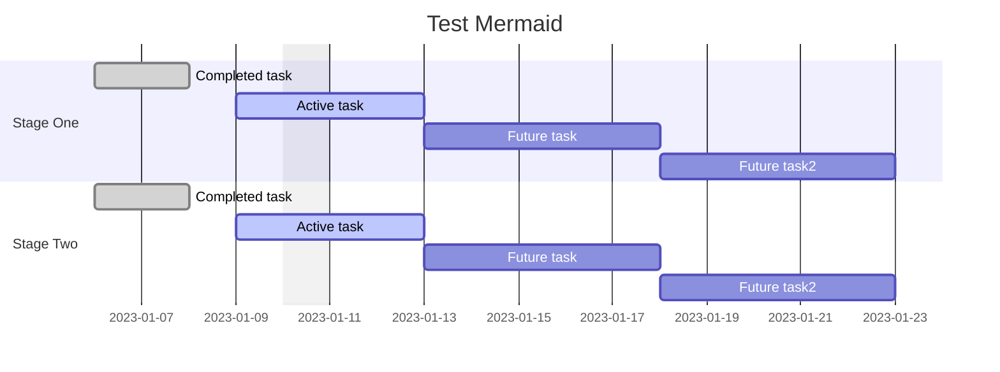
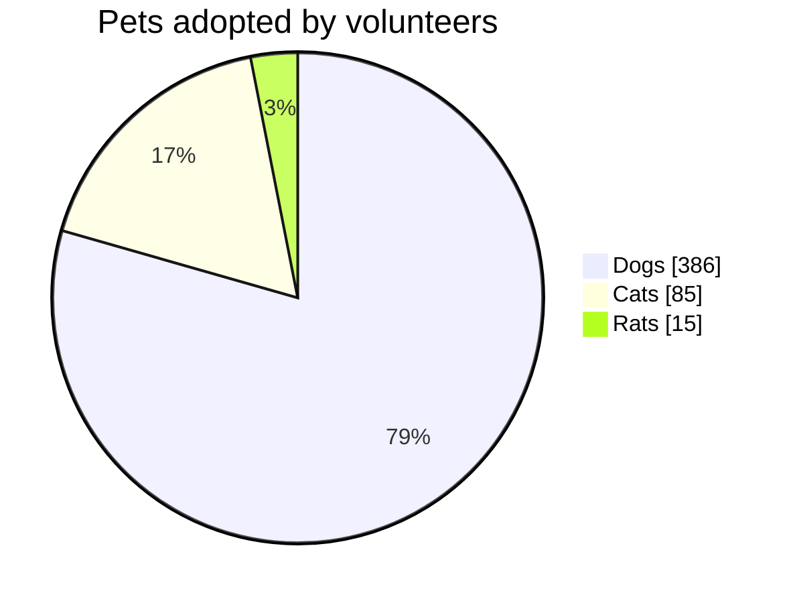
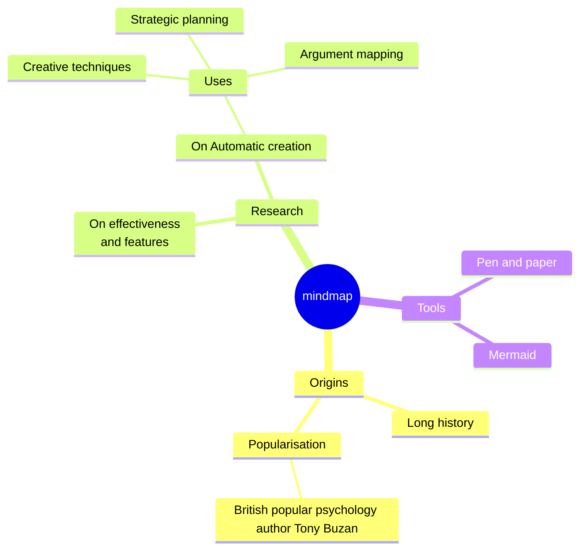
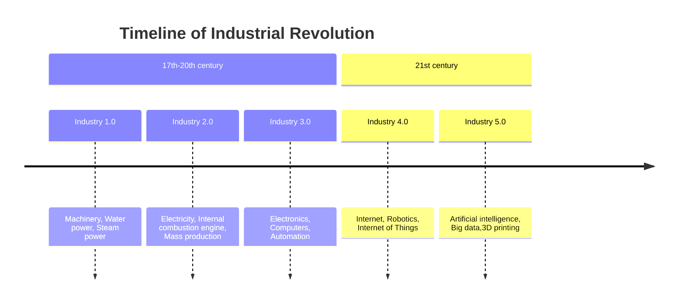
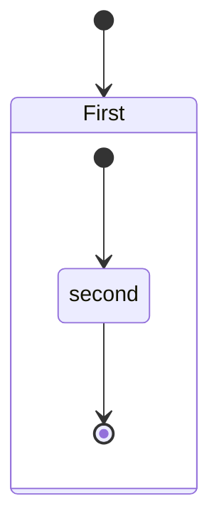
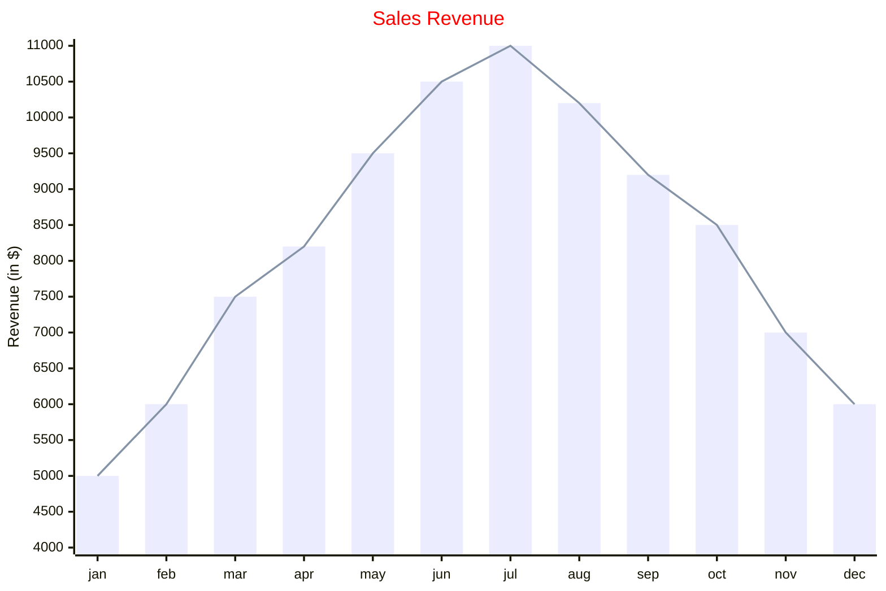

## Mermaid

[Mermaid 使用教程：从入门到精通](https://zhuanlan.zhihu.com/p/627356428)

### Gantt

官方说明: <http://mermaid.js.org/syntax/gantt.html>



### Pic Chart



### Mindmaps



### Timeline



### State Diagram



### XYChart



## Bitfield

```bitfield {vspace=100}
[
  {name: 'IPO',   bits: 8},
  {               bits: 7},
  {name: 'BRK',   bits: 5, type: 4},
  {name: 'CPK',   bits: 1},
  {name: 'Clear', bits: 3, type: 5},
  {               bits: 8}
]
```

## Ditaa[^1]

## Markmap

[官方Doc](https://markmap.js.org/docs/json-options)

[^1]:[字符画——ditaa使用指南，文本格式下作图](https://zhuanlan.zhihu.com/p/429506479?utm_id=0)
